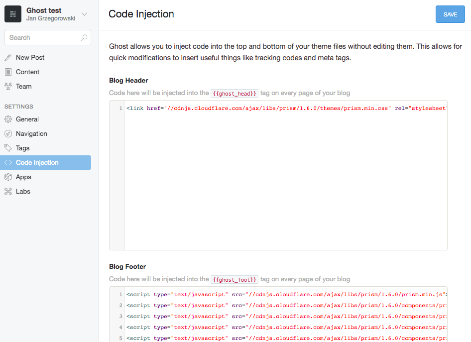
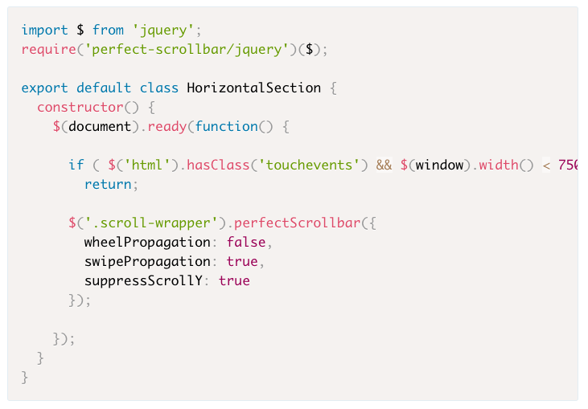

Running any kind of code related blog on the Ghost platform would eventually require adding some syntax highlighting to your code snippets. The easiest solution is usin [Prism.js](http://prismjs.com/) library and the quickest way to do that is linking it directly from CDN.

Let's find some resources and link them to the blog!

Everything should be put in fields inside _Code Injection_ menu tab:


CSS should be places inside _Blog Header_ field:

```html
<link
  href="//cdnjs.cloudflare.com/ajax/libs/prism/1.6.0/themes/prism.min.css"
  rel="stylesheet"
/>
```

JS should be places inside _Blog Footer_:

```html
<script
  type="text/javascript"
  src="//cdnjs.cloudflare.com/ajax/libs/prism/1.6.0/prism.min.js"
><\/script>
```

Now when core files are in place you should think for a while about languages that are going to be used. Language-specific files should be placed in the _Blog Footer_ section of your _Code Injection_ tab below the Prism.js core.
In this example I will add _PHP_, _CSS_, _HTML_ and _JS_ support:

```html
<script
  type="text/javascript"
  src="//cdnjs.cloudflare.com/ajax/libs/prism/1.6.0/components/prism-php.min.js"
><\/script>
<script
  type="text/javascript"
  src="//cdnjs.cloudflare.com/ajax/libs/prism/1.6.0/components/prism-css.min.js"
><\/script>
<script
  type="text/javascript"
  src="//cdnjs.cloudflare.com/ajax/libs/prism/1.6.0/components/prism-html.min.js"
><\/script>
<script
  type="text/javascript"
  src="//cdnjs.cloudflare.com/ajax/libs/prism/1.6.0/components/prism-js.min.js"
><\/script>
```

As you may noticed the CDN path for every language is generic, so you should be able to just guess it if you need some more urls. Just to make sure you may also check official CDN files list at https://cdnjs.com/libraries/prism

**NOTE**: In the examples above I've used **Prism.js 1.6.0** version but chances are that when you are reading this post there is already a newer version. Check out Prism.js site to make sure you are using most recent release.

Of course in order to trigger correct syntax highlighting you have to define language used in the sample by appending its name after code block marks. As an example, in order to trigger Javascript highlighting you should write your code inside:

    ```javascript
    // here is your JS code
    ```

As a result of all the efforts, you should see nicely highlighted code. Here is an example from one of my posts:


