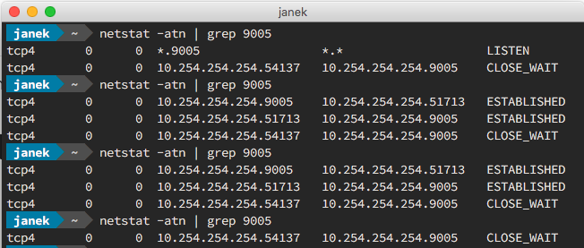

After spending a nearly whole day fighting with Xdebug setup I think it is a right moment to write some complete Xdebug guide.

In this article I will describe the following setup:

- Docker for Mac
- PHP with Xdebug (a Docker container)
- Vim
- vdebug (Vim PHP debugging plugin)

I think/hope that even if you use a slightly different configuration you may find a couple of useful hints in this text.

## The Docker container
First of all, let's get some Xdebug ready container. I've used [php-docker-boilerplate](https://github.com/webdevops/php-docker-boilerplate) by WEBDEVOPS which has some documentation and it is preconfigured to run a PHP server with everything else you may need for a modern web development process.

> No matter which Docker container you will use there is **no need to publish/expose** any additional port for Xdebug!

**Don't write** something like:
```
docker run -p 9000:9000 your_xdebug_server_image
```

Why?
Because Xdebug (which is running on your container/server) **doesn't** listen on that port, it just sends some data to that port (to your computer on which you are working). So there is no need to publish it, your computer will never try to connect to the Xdebug via 9000 port.


While not beeing a Xdebug nor DBGP protocol expert I see this architecture/communication as follows:
1. You start DBGP session in your debugger (Vim or some IDE like PHPStorm)
2. Your local computer starts listening on 9000 port (by default)
3. You run PHP script or make a request to a website
4. The server tries to connect to your debugger via DBGP protocol
5. The server checks a configuration of the Xdebug to find out the connection details
6. Based on that configuration The server tries to connect with Your local computer on the given IP and port number
7. If The server manages to connect with the debugger (the debugger is listening on given IP and port number) it stops script execution
8. Debugger takes the control over code execution
9. Depending on user action, debugger sends back some instructions to the Xdebug on the same port on which Xdebug connects with the debugger
10. Everything is working as expected


## The Xdebug configuration

Normally you would define the configuration inside `php.ini` file (e.g. `/etc/php/7.0/fpm/php.ini` or similar). But for the container which I am using it is located inside `./etc/php/development.ini` (path relative to the `docker-compose.yml` location). So here is the Xdebug configuration:
```
; XDebug
xdebug.remote_host             = 10.254.254.254
xdebug.remote_autostart        = 1
xdebug.remote_enable           = 1
xdebug.remote_port             = 9000
xdebug.default_enable          = 1
xdebug.remote_connect_back     = 0
```

It is the configuration specific for the **Docker for Mac**. Normally you may define `xdebug.remote_connect_back = 1`, so the `xdebug.remote_host` is not required (which is much more convenient). Unfortunatelly Docker for Mac (due to OS X limitations) has to have `xdebug.remote_host` defined and the `remote_connect_back` [is not supported](https://forums.docker.com/t/ip-address-for-xdebug/10460).

What is more OS X limitations forces defining a static `remote_host` IP address and the only way to get such address is creating a loopback address alias with `ifconfig` like so:
```bash
sudo ifconfig lo0 alias 10.254.254.254
```
Of course it might be any IP, but be careful to not to shadow some existing server e.g. `8.8.8.8` is a Google DNS. Anyway `10.254.254.254` seems to be a safe bet (widely used across the Docker community) so I would advise you not to change it without any good reason.

> For automatic IP setup on each system startup check [this gist](https://gist.github.com/ralphschindler/535dc5916ccbd06f53c1b0ee5a868c93)

Another important line is `xdebug.remote_enable = 1` which is responsible for Xdebug remote debugging.


## The debugger configuration

In this example I will be configuring `vdebug` Vim plugin (which is a simple DBGP capable debugger), but similar configuration should be available in any other debugger (e.g. PHPStorm).
First of all your debugger should listen / wait for connection on selected port (which is **9000** by default) and secondly it should listen on the interface connected with Docker (or any interface if it is possible).
In case of Vim vdebug above considerations are traslated to the:
```
let g:vdebug_options = {
      \ 'port' : 9005,
      \ 'server' : '',
      \ 'path_maps': {
        \ '/app/web/': '/Users/jmarceli/Work/wordpress/my_site/web/'
      \ }
      \}
```
Which should be appended to the `~/.vimrc` file.

`path_maps` is a useful option which lets you view your remote files mapped on the local path so you can view and edit them while still working inside the debugger view. Probably some similar option is available in any other decent debugger.
In case of Vim there is one small problem. You may have multiple projects with the same path on a server but different paths in the local environment. This issue is discussed on the [official Github repo](https://github.com/joonty/vdebug/issues/197) where you may find some useful comments related to the automatic changing the root dir.

## Test

That's all now you should be able to run your PHP code with the debugger attached to the selected line.


## Troubleshooting

When everything goes well this section is not important, but as always you may run into some problems (like I do). Here is how to test and check everything in this setup.

### Check the debugger

For troubleshooting, I would advise using `nmap` (for your Linux based containers):

```bash
apt-get update
apt-get install nmap
nmap -p 9000 10.254.254.254
```

After executing that command from your Docker container with Xdebug enabled PHP server the debugger (on your computer) should/may exit (like my `vdebug` does), which means that it receives some message. This behavior will confirm that port number `9000` and IP address `10.254.254.254` are correct choice and should be used in Xdebug configuration.

### Look for port open for listening

Another test which may be executed is port scanning either with default Mac Newtork Utility Port Scan or using `netstat`:
```bash
netstat -atn | grep 9000
```

The desired result after running the debugger is some output from `netstat` which will confirm that the debugger is listening on 9000 port. Here is an example.



In the picture you may see that after first execution debugger was listening on 9005 port, then Xdebug connection was made and finally debugging session has been finished.

### Change a default Xdebug port

One more thing is using a custom port for Xdebug. As you may noticed in previous example I'm not using default **9000** port but **9005** instead. This is just a precaution made because of reported issues with 9000 port which is sometimes used by other applications (e.g. php-fpm).

## Useful links

https://docs.docker.com/docker-for-mac/networking/#per-container-ip-addressing-is-not-possible - Official Docker for Mac documentation
