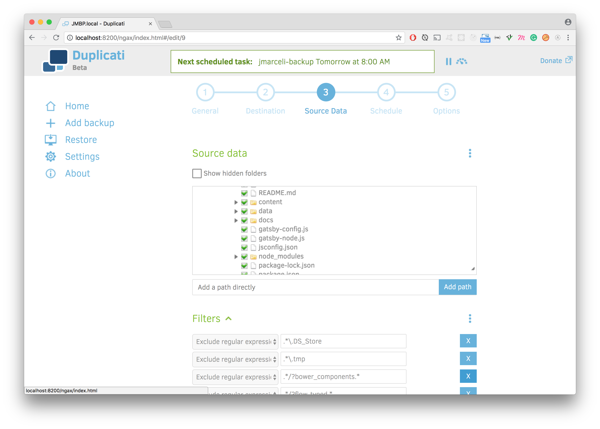
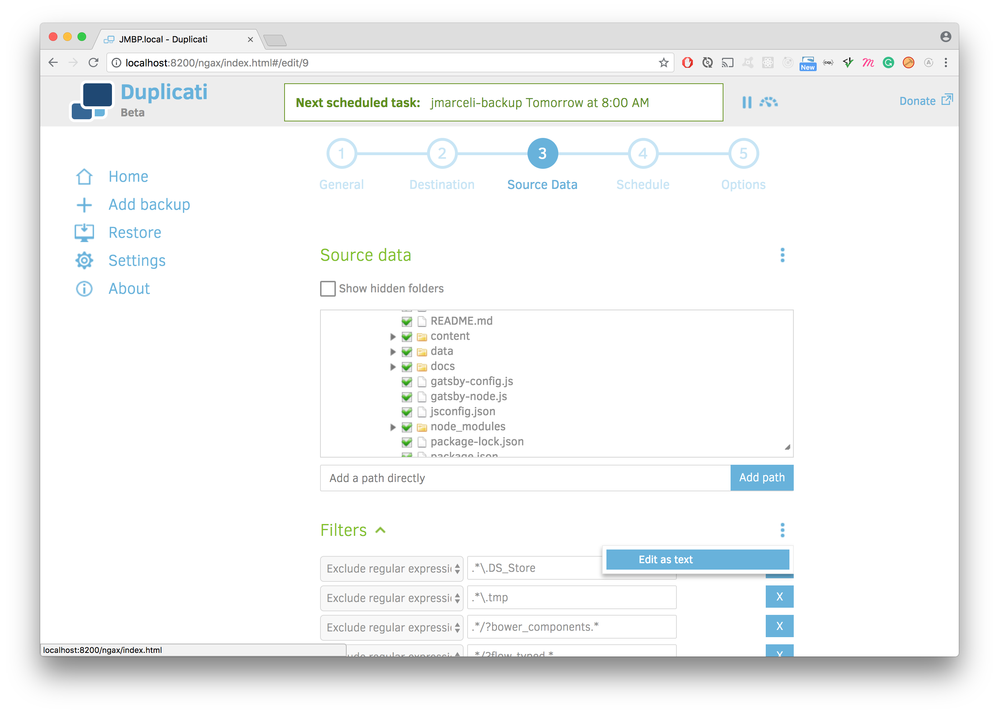
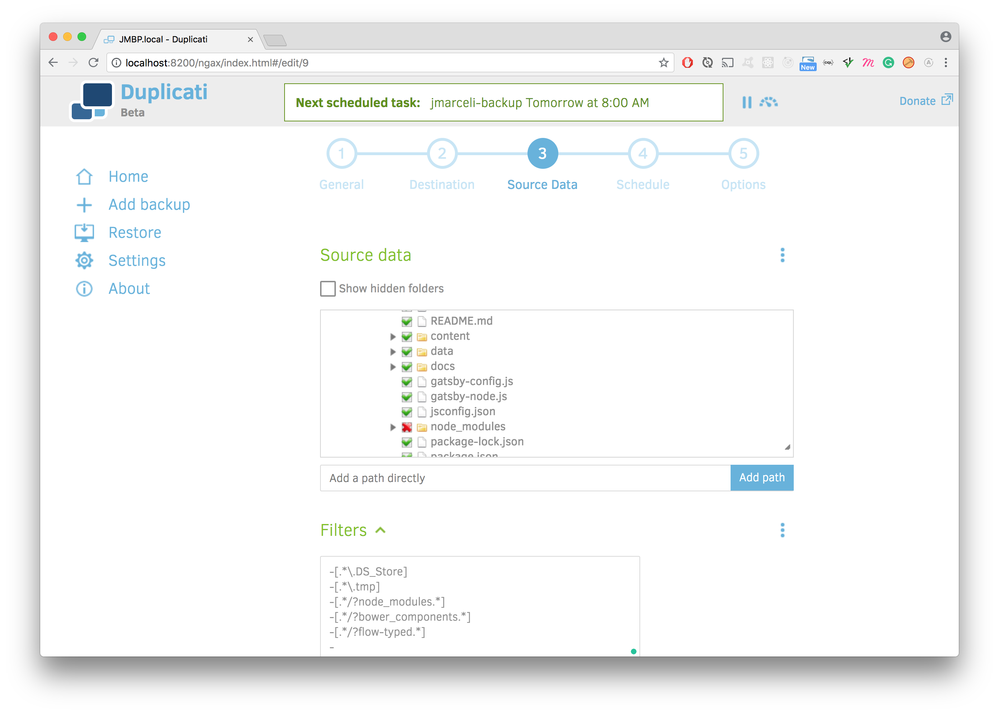

[Duplicati](https://www.duplicati.com/) is a free backup tool which is my current choice for cloud backups.

## Why
Some time ago I wrote a [post about Restic](https://grzegorowski.com/restic-backblaze-b2-backups) which is a nice backup tool, but at the time of writing this...
It lacks backup files compression.
It doesn't have built-in scheduler.
It has only command line interface.
It has some ["cost effectiveness" issues regarding Backblaze B2](https://grzegorowski.com/restic-backblaze-b2-backups/#backblazeb2pricing) integration.
It is hard to tell/verify which files are excluded from backup.

All of those makes me wonder if there is some other (preferably open source) tool. As for now it's [Duplicati](https://www.duplicati.com/).

## Duplicati regex filters
The main problem with regexes in Duplicati (at least for me) was .NET syntax. If you want to write anything more sophisticated than examples from the [official documentation](https://duplicati.readthedocs.io/en/latest/appendix-d-filters/) you should test it on http://regexstorm.net/tester first.

Examples:
```bash
.*/sources/.*/cache/\S+
```
Will match every file inside `anotherdir` except directory itself (it is useful construction for every auto-generated cache).

```bash
.*\.DS_Store
```
Matches every `.DS_Store` file (which is useful for Mac OS X).

```bash
.*/sources/.*/images/_[^original]\S+
```
Matches every directory/file inside `images` directory which name doesn't start with `_original`.

```bash
.*/sources/.*/?somedirectory/
```
Will match every `somedirectory/` inside `sources/` dir no matter how deeply nested it is (or even if it is not nested at all). These paths matches regex above:
- `something/sources/first/second/third/somedirectory/`
- `something/sources/somedirectory/`
- `something/sources/another/dir/somedirectory/`

**NOTE**
For reasons I don't understand:
```bash
.*/sources/.*/cache/.+
```
Does also match `test/sources/sth/cache/` directory itself that is why I use `\S+` instead of `.+` when I don't want to exclude cache directories only files/folders inside them.

**IMPORTANT**
If you decide to play with filters it is good to know that **Source data** panel inside **Source data** section works "live".

You may edit filters list as text and then go back to filters list view.

So after adding a filter inside **Filters** panel you can preview included/excluded files directly inside **Source data** panel.
**Source data** panel is updated when you remove focus (click outside) **Filters** edit box.


### Example

Here are my Duplicati filters. You may use them as a starting point if you wish (just paste them after clicking "Edit as text" in **Filters** inside **Source Data** section):
```
-[.*\.DS_Store]
-[.*\.tmp]
-[.*/?node_modules.*]
-[.*/presta/.*/?cache/\S+]
-[.*/wordpress/.*/?cache/\S+]
-[.*/wordpress/.*app/themes/.*dist.*]
-[.*/wordpress/.*app/themes/.*vendor/.*]
-[.*/wordpress/.*vendor/.*]
-[.*/wordpress/.*fly-images/.*]
-[.*/ruby/.*log/\S+]
-[.*/ruby/.*tmp/\S+]
-%HOME%/Dropbox/
-%HOME%/Calibre Library/
-%HOME%/Azure/
-%HOME%/Movies/
-%HOME%/Music/
-%HOME%/VboxShared/
-%HOME%/VirtualBox VMs/
-%HOME%/backup_test/
-%HOME%/tmp/
-%HOME%/.babel-cache/
-%HOME%/.cache/
-%HOME%/.composer/
-%HOME%/.cordova/
-%HOME%/.cups/
-%HOME%/.dropbox/
-%HOME%/.docker/
-%HOME%/.electron/
-%HOME%/.electron-gyp/
-%HOME%/.fontconfig/
-%HOME%/.gem/
-%HOME%/.ghost/
-%HOME%/.grip/
-%HOME%/.heroku/
-%HOME%/.ievms/
-%HOME%/.ionic/
-%HOME%/.kayak-installer/
-%HOME%/.kube/
-%HOME%/.jspm/
-%HOME%/.meteor/
-%HOME%/.local/
-%HOME%/.ngrok/
-%HOME%/.node-gyp/
-%HOME%/.npm/
-%HOME%/.nvm/
-%HOME%/.oracle_jre_usage/
-%HOME%/.pachyderm/
-%HOME%/.pgadmin/
-%HOME%/.prisma/
-%HOME%/.putty/
-%HOME%/.raygun/
-%HOME%/.reaction/
-%HOME%/.rvm/
-%HOME%/.subversion/
-%HOME%/.vagrant.d/
-%HOME%/.wireshark/
-%HOME%/.wireshark-etc/
-%HOME%/.wp-cli/
-%HOME%/.yarn/
-%HOME%/.Trash/
-%HOME%/Downloads/
-%HOME%/Library/Logs/
-%HOME%/Library/iMovie/
-%HOME%/Library/iTunes/
-%HOME%/Library/WebKit/
-%HOME%/Library/VirtualBox/
-%HOME%/Library/Dropbox/
-%HOME%/Library/Caches/
-%HOME%/lib/azure-cli/
```

## Restoring
Files restoring is easy but you should be aware of the fact that if you select let say `/Users/username/your/foldername` the `foldername` itself won't be restored, just files inside it. I don't know if it is normal but for me it was a little tricky.

## Sources
https://duplicati.readthedocs.io/en/latest/appendix-d-filters/
https://docs.microsoft.com/en-us/dotnet/standard/base-types/regular-expression-language-quick-reference
https://docs.microsoft.com/en-us/dotnet/standard/base-types/regular-expressions
http://regexstorm.net/tester
