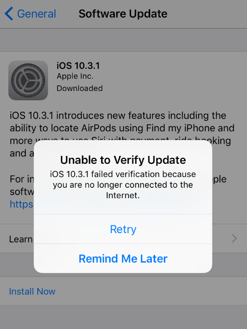

Recently I've tried to install the newest iOS 10.3.1 update on my iPhone. Unfortunately, instead of a successful installation, I was getting **Unable to Verify Update** error message.

After spending some time looking for the solution on the internet I've decided to take the simplest step, restarting the device.

Guess what. After:

> turning it off and on again

and clicking **Install Now** button update starts downloading itself and then a normal update process has begun.

I hope it will help someone to solve a similar issue.
