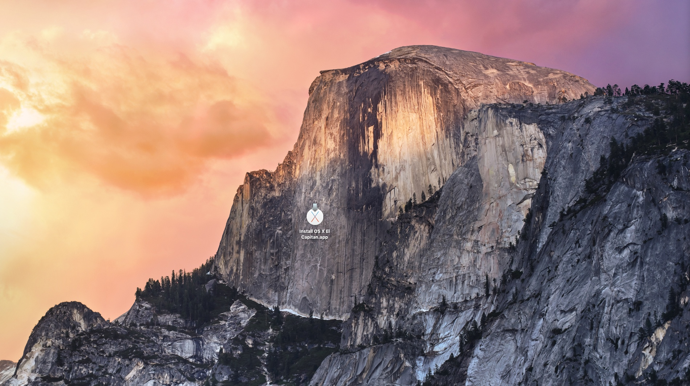

Recently minimal system requirements of the new [Sketch App 42](https://www.sketchapp.com/updates/#version-42) forces me to make an OS X upgrade. It turns out that upgrading to the **not most recent OS X** version is quite complicated.

When there is newer OS X available (e.g. Sierra) there is **no way** to download the previous version (e.g. El Capitan) from App Store. The only way is to find someone who has already downloaded required OS version. Such person will have an appropriate download link available inside *Purchased* tab in the App Store. You will have to copy the .app from him to your desktop (e.g. by using a pendrive).

When you have an .app file on your desktop just double click it and follow the installation instructions. The name "installation" may mislead you because the application will perform an upgrade of your current system, not a clean install (which is what I was looking for).

During the system upgrade you won't loose your data, although a backup copy with a Time Machine is always a good idea - you should have it.

After a couple of minutes (in my case about 40 minutes) you will be able to login to the upgraded OS.

This may be obvious for you but I wasn't sure about my every day **CLI tools** such as **RVM, NPM, Meteor** and others. The good news is that **everything works as expected** after OS upgrade. There was **no need of reinstallation or reconfiguration**.

The system upgrade from Yosemite to El Capitan (in my case) doesn't cause any additional/unexpected work which is something that I was worried about.
