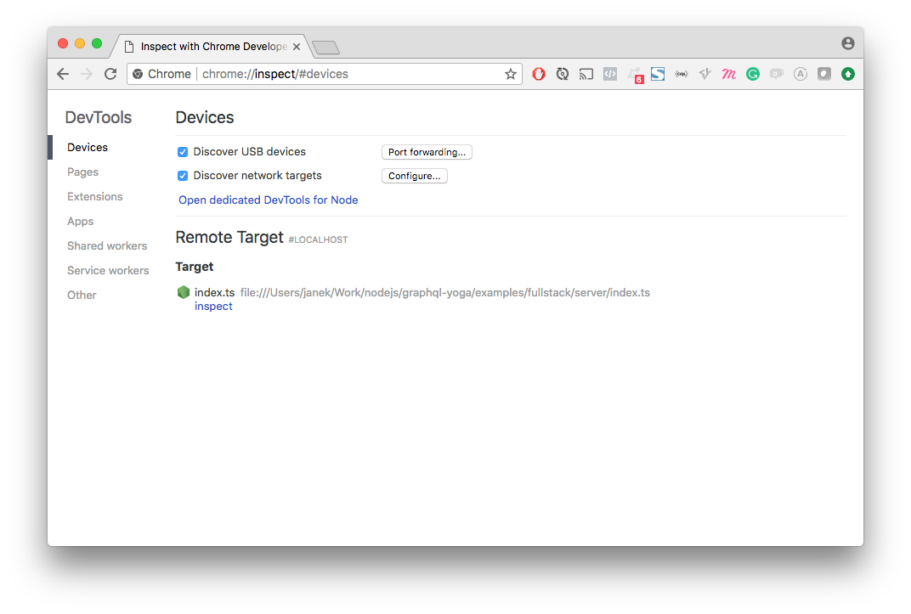

Aggregated information about debugging in various languages and frameworks.

## Meteor

see: https://forums.meteor.com/t/meteor-1-6-server-debugging-with-vs-code/39821/3

```bash
meteor run --inspect-brk
```

Then visit (in Chromium browser): chrome://inspect page. Inside **Remote Target** section you will find all available debugging sessions.

## NodeJS

Debugging server side (in console):
```bash
node debug .
```

Debugging using chrome debugger:
```bash
node --inspect .
```
or with [nodemon](https://github.com/remy/nodemon) and Typescript:
```bash
nodemon --inspect -r ts-node/register index.ts
```

**IMPORTANT**
* As mentioned in SO https://stackoverflow.com/questions/41398970/can-i-get-node-inspect-to-open-chrome-automatically Chrome 60+ has excellent option of autoconnecting to NodeJS debugger. Just open: [chrome://inspect/#devices](chrome://inspect/#devices) and click "Open dedicated DevTools for Node" link.

Now every time you start node with `--inspect` flag DevTools will "catch" the connection.

## NodeJS Mocha tests

With new Chrome DevTools for NodeJS you may run mocha tests debugger with:
```bash
mocha --inspect tests.js
```

see: https://stackoverflow.com/questions/14352608/whats-the-right-way-to-enable-the-node-debugger-with-mochas-debug-brk-switch

```bash
mocha debug tests.js
```

Write `debbuger;` in line where you want debugger to stop.
```bash
debug>
```

After stopping you will have a bunch of options which you may list by executing `help` command.
```bash
debug> help
run, restart, r       Run the application or reconnect
kill                  Kill a running application or disconnect

cont, c               Resume execution
next, n               Continue to next line in current file
step, s               Step into, potentially entering a function
out, o                Step out, leaving the current function
backtrace, bt         Print the current backtrace
list                  Print the source around the current line where execution
                      is currently paused

setBreakpoint, sb     Set a breakpoint
clearBreakpoint, cb   Clear a breakpoint
breakpoints           List all known breakpoints
breakOnException      Pause execution whenever an exception is thrown
breakOnUncaught       Pause execution whenever an exception isn't caught
breakOnNone           Don't pause on exceptions (this is the default)

watch(expr)           Start watching the given expression
unwatch(expr)         Stop watching an expression
watchers              Print all watched expressions and their current values

exec(expr)            Evaluate the expression and print the value
repl                  Enter a debug repl that works like exec

scripts               List application scripts that are currently loaded
scripts(true)         List all scripts (including node-internals)

profile               Start CPU profiling session.
profileEnd            Stop current CPU profiling session.
profiles              Array of completed CPU profiling sessions.
profiles[n].save(filepath = 'node.cpuprofile')
                      Save CPU profiling session to disk as JSON.

takeHeapSnapshot(filepath = 'node.heapsnapshot')
                      Take a heap snapshot and save to disk as JSON.
```
Use `list([number_of_lines])` to view code around breakpoint e.g.
```bash
list(5)
```

Probably the most useful one is `repl` command which will show NodeJS REPL (https://nodejs.org/api/repl.html) with all variables from your application.

When you are inside REPL use TAB key to list all available/visible variables.

To exit REPL hit **Ctrl+C**.

To exit debugger execute `.exit` command.
