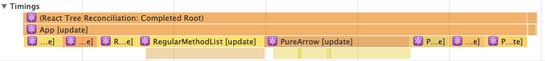
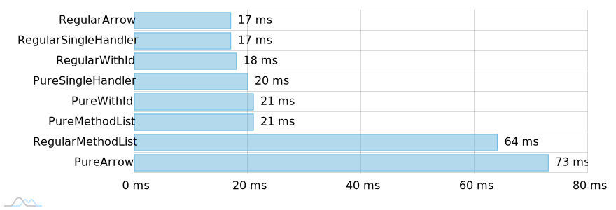

How to bind handlers in React to multiple similar elements e.g. buttons on list?
Is it any better to use one handler and identify clicked elements (like it was in jQuery days) than binding them to each element?
Is it an "expensive" operation to bind an event handler in React?

TLDR; There is nearly no benefit from using only one handler bound to the parent container, but it is fairly important to avoid handler creation during rendering if you use Pure components as a children.

## Overview

If you have a list of elements you may either set `onClick` property to each of rendered elements or create `onClick` handler in the parent container.
I will try to show the difference between those two approaches.

## Example

Each component is a button which shows its ID in the browser console in response to click event.

<iframe src="https://codesandbox.io/embed/6lo82zrlzw?fontsize=14&view=preview" style="width:100%; height:500px; border:0; border-radius: 4px; overflow:hidden;" sandbox="allow-modals allow-forms allow-popups allow-scripts allow-same-origin"></iframe>

In order to measure perfomance go to https://6lo82zrlzw.codesandbox.io/ and open Chrome DevTool Performance tab.

## Description

In each case there were 1000 fairly simple React components rendered and measured.

There are two types of components in this example:

- Regular - standard React.Component
- Pure - React.PureComponent

And four ways of providing element context/information to event handler:

- Arrow - wrapping event handler in arrow function, data as an argument
- WithId - passing data through `data-id` and getting it through (`event.currentTarget`)
- SingleHandler - passing data through `data-id` and having one shared handler (`event.target`)
- MethodList - wrapping handler inside class method

Here are the results from Google DevTools Performance tab.

I've calculated average rendering time from 17 full page re-renders. Non of this re-renders was an initial render.
Numbers from perfomance tab looks as follows (lower number is better).

- 17 ms RegularArrow
- 17 ms RegularSingleHandler
- 18 ms RegularWithId
- 20 ms PureSingleHandler
- 21 ms PureWithId
- 21 ms PureMethodList
- **64 ms** RegularMethodList
- **73 ms** PureArrow

Avarage render time of each components list as a bar chart.

<small>Chart rendered with <a href="https://www.amcharts.com/">amCharts 4</a> library</small>

It is not a big suprise that **PureArrow** component was the slowest one, as for each re-render shallow equality comparison has to be executed and in each case component has to be re-rendered due to the fact that arrow function creates new handler function during rendering.

Surprising is the fact that **RegularMethodList** is second slowest way of event handling. I guess that that is due to the large overhead required for new component initialization, and on each re-render new component has to be created.

What surprises me about this test is the fact that there is no benefit from having a single handler attached to parent component as it will be beneficial in the jQuery times.

## Links

- https://docs.google.com/document/d/1CvAClvFfyA5R-PhYUmn5OOQtYMH4h6I0nSsKchNAySU/edit# - official Google docs about data export from DevTools Performance tab
- https://www.amcharts.com/ - charting library used to render bar chart with rendering times
- https://ymm959qlxv.codesandbox.io/ - Google Chrome Performance tab visualizer app (source code: https://codesandbox.io/s/ymm959qlxv)
