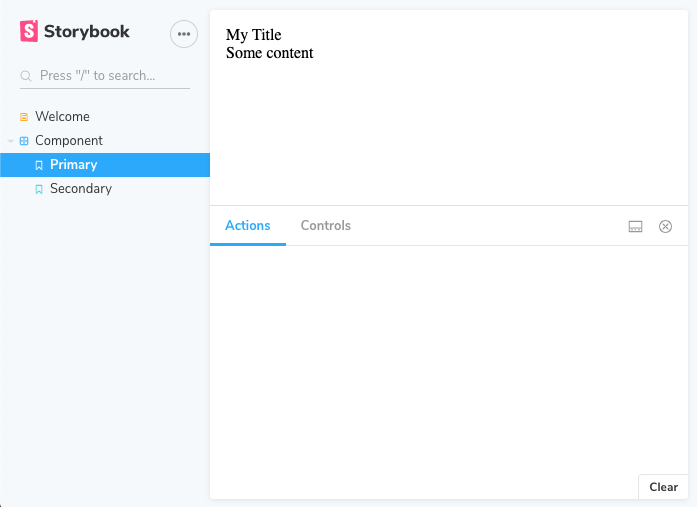

In this part of React Typescript library setup tutorial I will describe how you can add Storybook base documentation for your components.
If you want to start from the beginning you may go back to the [part 1](https://www.grzegorowski.com/react-typescript-library-rollup-jest-initialization) where initial Rollup and Typescript setup is described.

TLDR; You can check https://github.com/jmarceli/jmarceli-react-ts-library for fully working project setup.

## Overview

Without an automated (or at least semi-automated) documentation tool it is hard to convince others to use your custom React components.
Regardless if you are aiming at open source community or company internal project a nice looking documentation page will always be a very welcome feature.
Storybook is (currently in May 2020) the most popular tool used for this purpose.

## Install & setup Storybook

It is extremely easy to do with `npx` just execute:

```bash
npx -p @storybook/cli sb init --type react
```

After it finishes you should see two new directories created inside you project directory:

- **.storybook/** - configuration files for Storybook (with only one `main.js` file inside)
- **src/stories/** - examples of Storybook stories (story is just a fancy name for a component documentation page)

> NOTE: It is more than possible than for other versions of the Storybook you will get a bit different results.
> I mean a different set of files might be generated.

What is more you will see some additional Storybook related packages installed as well as two new commands `storybook` and `build-storybook`
which you can run through `npm` e.g. `npm run storybook` will start Storybook server with livereload.

If you run `npm run storybook` now you will see in the console something similar to:

```sh
> start-storybook -p 6006

info @storybook/react v6.0.22
info
info => Loading presets
info => Loading presets
info => Loading config/preview file in "./.storybook".
info => Loading config/preview file in "./.storybook".
info => Adding stories defined in ".storybook/main.js".
info => Using default Webpack setup.
webpack built d511c03bb6e1cafde3b4 in 15014ms
╭─────────────────────────────────────────────────────╮
│                                                     │
│   Storybook 6.0.22 started                          │
│   16 s for manager and 18 s for preview             │
│                                                     │
│    Local:            http://localhost:6006/         │
│    On your network:  http://10.254.254.254:6006/    │
│                                                     │
╰─────────────────────────────────────────────────────╯
```

It means that after entering http://localhost:6006/ in the browser you will see the Storybook but as for now only example components are visible.
Let's adjust Storybook configuration!

## Storybook basic configuration

For starter I would suggest to remove auto-generated **src/stories/** or move them somewhere as you may need them later for reference.
Now you can write your own stories.
The **src/Welcome.stories.mdx** file might be your new Storybook welcome page:

```md
<Meta title="Welcome" />

# Welcome to Storybook

This is your Storybook homepage.
```

It's an mdx file so you can mix JavaScript HTML and Markdown.
The only required content is `<Meta title="" />` which is responsible for sidebar menu entry.

Now we can add our own stories for the existing component located inside **src/component/**.
But before we do so let's make the component a bit more "interesting" by adding a few new properties.
We will replace a content of the **src/component/Component.tsx** file with:

```jsx
import React from "react";

type Props = {
  children: React.ReactNode,
  title: string,
};

export const Component: React.FC<Props> = ({ children, title }) => {
  return (
    <div>
      <div>{title}</div>
      <div>{children}</div>
    </div>
  );
};
```

Effectively adding `children` and `title` properties.
Now we should fix tests inside **src/component/Component.test.tsx** by replacing:

```jsx
render(<Component />);
```

with:

```jsx
render(<Component title="title">sample component</Component>);
```

After that enhancements we are ready to write our first stories inside **src/component/Component.stories.tsx** file:

```jsx
import React from "react";
import { Component } from "./Component";

import { Meta } from "@storybook/react/types-6-0";

// Primary will be the name for the first story
export const Primary: React.FC<{}> = () => (
  <div>
    <Component title="My Title">
      <div>Some content</div>
    </Component>
  </div>
);

// Secondary will be the name for the second story
export const Secondary: React.FC<{}> = () => (
  <Component title="Another title">
    <div>Secondary component</div>
  </Component>
);

export default {
  title: "Component", // Title of you main menu entry for this group of stories
  component: Component, // This is the component documented by this Storybook page
} as Meta;
```

You may have noticed that there is an issue with `@storybook/react/types-6-0` in order to fix it you should adjust **tsconfig.json** placed inside repository/project root.
Please uncomment the line:

```js
"moduleResolution": "node",            /* Specify module resolution strategy: 'node' (Node.js) or 'classic' (TypeScript pre-1.6). */
```

Now you should be good with your first two stories in Storybook.
Execute `npm run storybook` and check the results in your browser.
I hope you will see something similar to this.



> NOTE: In Storybook 6.x you will get Typescript support out of a box!
> No fancy configuration required to work with .tsx files.

> NOTE: If you were working with some previous versions of the Storybook and @storybook/addon-docs you may have noticed a disappearance of the "view" selector.
> It was placed in the left top corner and it allows to switch between "Canvas" and "Docs" view.
> I'm not entirely sure why they have removed it but you may try adding `viewMode: 'docs'` to the **.storybook/preview.js** file or add `--docs` option to your `start-storybook` command inside **package.json**.

## Next steps

As the Storybook supports now Typescript out of the box this step wasn't very difficult to complete.
The next one is in my opinion some kind of a pipeline which will let you automate library publication and reduce manual work.
That will be the next chapter (I hope to write it soon).

## Sources

- https://storybook.js.org/docs/react/get-started/install - Storybook official docs
- https://github.com/storybookjs/storybook/blob/next/MIGRATION.md - migration guide useful if you already have some legacy Storybook installation
- https://github.com/jmarceli/jmarceli-react-ts-library - example repository
