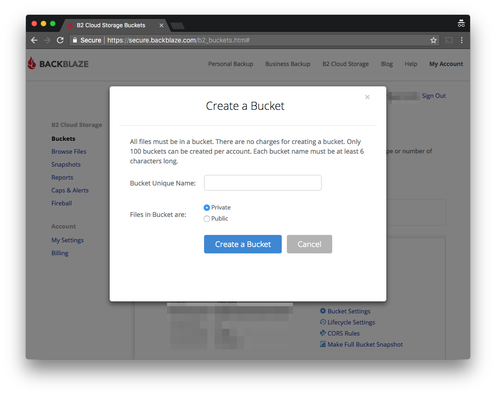
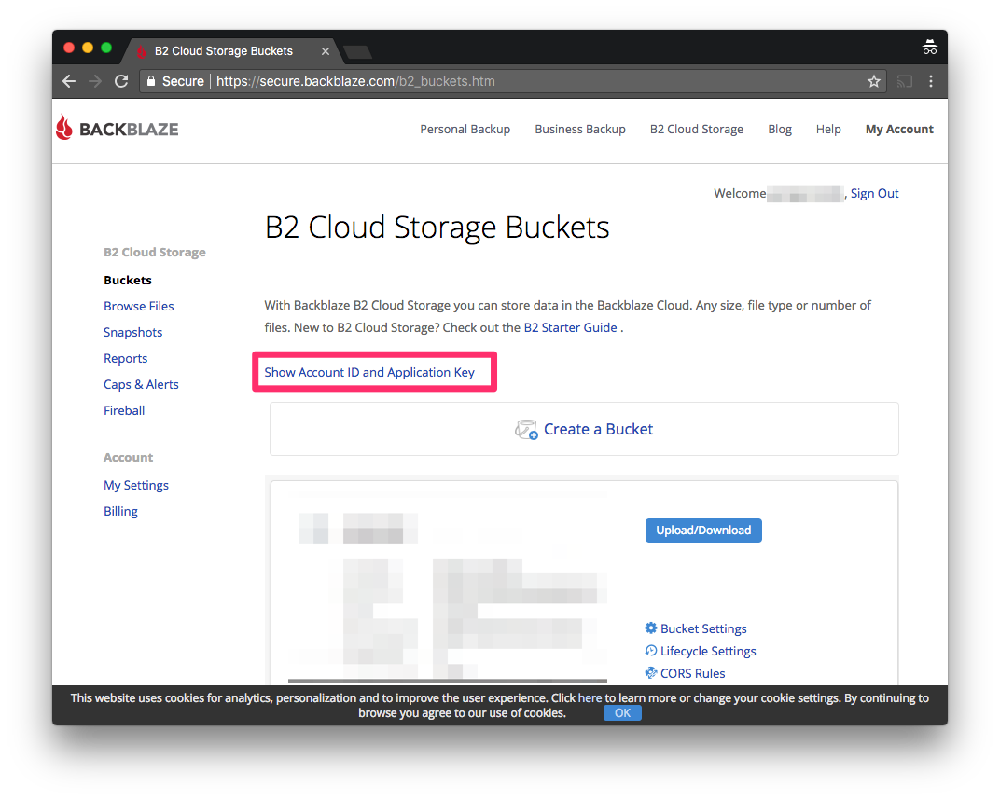
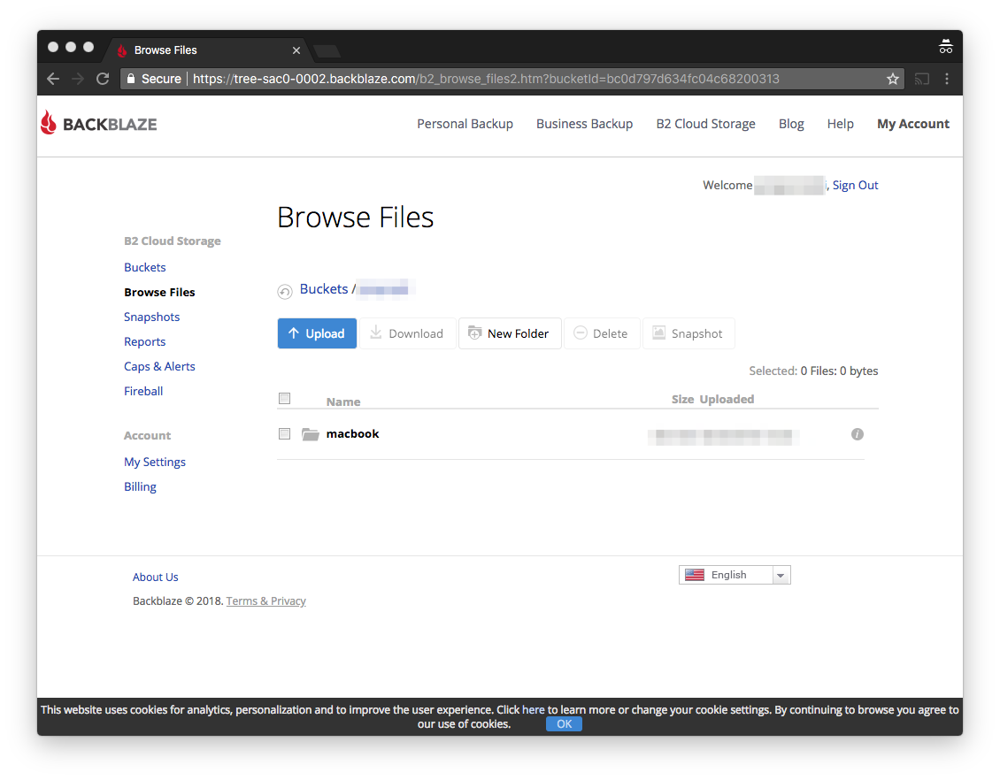

How to create [Restic](https://restic.net/) based backup using [Backblaze B2](https://www.backblaze.com/b2/cloud-storage.html) cloud storage as a backend.

<small>This tutorial was made on **Mac OS X High Sierra** with **restic 0.8.3** (which may or may not be relevant to you).</small>

**NOTE**
Example shell script is available [at the end](#examples) of this post.

## Backblaze B2
Let's start with Backblaze B2 as you will need some cheap cloud storage.

Create a Backblaze account.

Login and create Backblaze B2 Bucket. You should easily find large "Create a Bucket" button after logging in to your account (which is also visible on the next screenshot).

Select **Private** type for **Files in Bucket**.

**NOTE**
Bucket name has to be globally unique so you would probably end up with prefixing it with your account name or something similar.

Check your Backblaze B2 credentials using link "Show Account ID and Application Key".

They will be required for the next steps so copy and paste them somewhere or just leave them open.

**NOTE**
After closing credentials popup you won't be able to view **Application Key** you will have to generate a new one.

## Restic
When your cloud storage space is ready it's time to install and initialize Restic repository.

### Install Restic on Mac OS X (with Homebrew):
```bash
brew install restic
```

### Install Restic on Ubuntu 16.04:
Check current release at https://github.com/restic/restic/releases
Copy url of selected version (for Ubuntu you should use `..._linux_386.bz2` packages)
Get the package and install it
```bash
wget https://github.com/restic/restic/releases/download/v0.8.3/restic_0.8.3_linux_386.bz2
bzip2 -d restic_0.8.3_linux_386.bz2
chmod +x restic_0.8.3_linux_386
mv restic_0.8.3_linux_386 /usr/bin/restic
```
Logout from the system and the login back.
Now you should be able to execute `restic version`, if it returns Restic related info it means that Restic is installed properly.

For other systems check the [official installation guides](https://restic.readthedocs.io/en/stable/020_installation.html).

If restic is installed execute following commands inside console replacing placeholders `<...>` with your Backblaze B2 account data:

```bash
export B2_ACCOUNT_ID=<MY_ACCOUNT_ID>
export B2_ACCOUNT_KEY=<MY_SECRET_ACCOUNT_KEY>
```

Now it's time to initialize your Restic repository.
```bash
restic -r b2:[bucket-name]:[repository-name] init
```
Where:
- `-r` repository to backup or restore from
- `b2` indicates Backblaze B2 storage
- `[bucket-name]` is a name of Backblaze B2 bucket which was created
- `[repository-name]` is an arbitrary name which will be the name of Restic root folder inside Backblaze B2 bucket

You may check that repository is initialized by using "Browse Files" link and then clicking on your bucket name (inside Backblaze B2 account). As an example here is mine bucket (with **macbook** as a `[repository-name]`).


After initialization you may start with first backup (it will take some/a lot of time depending on the backup size).
```bash
restic -r b2:[bucket-name]:[repository-name] backup [dirs-to-backup]
```
Where:
- `-r` repository to backup or restore from
- `b2` indicates Backblaze B2 storage
- `[bucket-name]` is a name of Backblaze B2 bucket which was created
- `[repository-name]` is an arbitrary name which will be the name of Restic root folder inside Backblaze B2 bucket
- `[dir-to-backup]` is the directory which you would like to backup e.g. `/Users/jmarceli/workspace`

The next executions of this command takes much shorter time as Restic backups are incremental, so only changes are going to be uploaded.

After successful backup you may/should check the backup integrity with:
```bash
restic -r b2:[bucket-name]:[repository-name] check
```

**NOTE**
Executing Restic check using cache may be a good solution if you want to save time and money, but remember that this won't be a full integrity test.
```bash
restic -r b2:[bucket-name]:[repository-name] check --with-cache
```

**NOTE**
To ease things you may define (executing following command in console):
```bash
export RESTIC_REPOSITORY=b2:[bucket-name]:[repository-name]
```
Now you can ommit `-r` option in every `restic` call.

**NOTE**
If you want (and you probably should) exclude some files from backup here is more info https://restic.readthedocs.io/en/latest/040_backup.html
For testing your path regexes you may use https://regex-golang.appspot.com/assets/html/index.html

## Restoring
Restoring is easy just check desired snapshot ID with:
```bash
restic snapshots
```

And with selected ID execute:
```bash
restic restore [ID] --target /tmp/tmp-restore --include some/file
```
Where:
- `/tmp/tmp-restore` is a path where files would be restored
- `some/file` limit restored files just to those which match `some/file` pattern

After that you will probably go to the `/tmp/tmp-restore` path (or any other that you define as a **--target**) and move restored files to correct locations.

## Removing old/outdated backups
You should probably run it after making a backup with `restic backup ...` command.
```bash
restic forget --keep-last 48 --keep-daily 7 --keep-weekly 4 --keep-monthly 3 --keep-yearly 3
```
Exact meaning of the flags with an example is described in the [Github issue#1562](https://github.com/restic/restic/issues/1562)

**NOTE**
There is a `--dry-run` flag which may be useful

## Scheduled backups
It's always nice to have some kind of automation for your backups. Restic doesn't come with any buildin solution, so the only option is a CRON job creation.

Provided that you created a Restic backup shell script named `~/restic_backup.sh` just execute `crontab -e` and add a line:
```
0 12 * * * /Users/username/restic_backup.sh
```

Now your `~/restic_backup.sh` will be executed each day exactly at 12:00.

**NOTE**
If you are using Vim you may need to `:set backupcopy=yes` when editing crontab file see [SO question](https://stackoverflow.com/questions/15395479/why-ive-got-no-crontab-entry-on-os-x-when-using-vim)

## Troubleshooting
As always there are some issues, this one is definitely my fault because of breaking the backup process due to sudden power off.

> Fatal: unable to create lock in backend: repository is already locked by PID 16697 on [mycomputername] by [username] (UID 501, GID 20)

Following the Google I found the Github [issue#1450](https://github.com/restic/restic/issues/1450)

Simple:
```bash
restic unlock
```
Does the job. After executing this command I was able to work with my repository again.

**NOTE**
On Mac OS X you may use following command to prevent system from sleeping:
```bash
caffeinate -s
```

## Backblaze B2 pricing
You may think that BackBlaze B2 and restic will guarantee you nearly free cloud backup. Well...

It's cheap, but definitely not as cheap as you may think.

Uploading is free and storage is really cheap (or event cheapest ATM), but there are some other (more or less) hidden charges like "Class B Transactions" and "Class C Transactions". Go [here](https://www.backblaze.com/b2/b2-transactions-price.html) for more info.

Unfortunatelly currently Restic makes a lot of "Class B Transactions" calls during `restic check` execution (which may be both costly and time consuming) see [issue#1696](https://github.com/restic/restic/pull/1696). Next (0.8.4+) restic release with "smart caching" should fix it.

Browsing files stored on your B2 (using "Browse Files" option) is counted to the downloads quota. It's cheap but not free.

Fortunatelly **restic** nearly doesn't use "Class C Transactions" but "Class B" is used a lot during `restic check` (which you may/should run after each backup).

What is more, with B2 pricing there is no point in running `restic prune` (as you may see I give up after 1.5 hour).
```bash
$ restic prune
enter password for repository:
password is correct
counting files in repo
building new index for repo
[23:04] 100.00%  13521 / 13521 packs
repository contains 13521 packs (897977 blobs) with 62.648 GiB
processed 897977 blobs: 267 duplicate blobs, 443.513 MiB duplicate
load all snapshots
find data that is still in use for 2 snapshots
[1:24] 100.00%  2 / 2 snapshots
found 861259 of 897977 data blobs still in use, removing 36718 blobs
will remove 0 invalid files
will delete 1055 packs and rewrite 6590 packs, this frees 27.166 GiB
  signal interrupt received, cleaning up
```
This may/will result in massive download for (as I think) packs rewritting (I've downloaded 6GB, made around 34k Class B Transactions and give up with progress around 17%). It's just cheaper to run a new backup and delete the old one... (at least in my case where I have around 60GB and want to remove a snapshot with accidentally added files).

### The first impression
Calculations based on https://www.backblaze.com/b2/cloud-storage-pricing.html may lead you to this equation (let say you got 100GB of data):
```
months * data_in_GB * storage_price = yearly_backup_price
12 * 100 * $0.005 = $6
```
But that is **not true** for real backup scenarios.

### The reality

**A year of incremental backups of 100GB data won't use 100GB but much more space.**
1TB, maybe more depends how much redundancy in data do you have and how often you would like to create snapshots.

**You may think why should I bother with a download price, you will do it only in case of data loss right?**
No. You should do `restic prune` from time to time to ensure old snapshots removal (we want to save space and money right?). Unfortunatelly `restic prune` downloads a lot of data to rewrite data packs that are going to stay on server after prune operation. That may cost you **a lot**.

**"Hidden" costs**
Things like "Transactions Class B and C" they seems to be cheap but they may become costly if you would like to (which you probably should) run `restic check` command frequently. Without that check you can't be 100% sure that backup files are not corrupted. If you doesn't have such certainty what's the point of paying for backup storage space?

## What's the real price?
I don't know. I've just started using **Backblaze B2** and **restic** combo with around 60GB of initial data.

Maybe you should check available storage options once more?
This seems to be fine starting point for the comparison: https://www.arqbackup.com/features/

## Alternatives?
From what I checked it seems that Wasabi is really the cheapest cloud storage, it seems to have nearly none hidden payments.
https://wasabi.com/pricing/pricing-faqs/

The only catch is a **minimal** space which you may buy which is 1TB, so it's **$4.99 per month**. In my case it makes Wasabi not so cheap (as I had only ~60GB) but if you have more data e.g. 800GB+ it might be worth it.

## Examples
Here is my example script for backups `~/restic_backup.sh`. Feel free to use it and modify according to your needs (especially replace all `[...]` with data approperiate for your backup configuration/storage space).
```bash
#!/bin/bash

export B2_ACCOUNT_ID=[account-id]
export B2_ACCOUNT_KEY=[account-key]
export RESTIC_REPOSITORY=b2:[bucket-name]:[repository-name]
export RESTIC_PASSWORD=[repository-pass]

# for the first run uncomment
#restic init

# prevent sleeping on OS X with: caffeinate -sw [backup_pid]

# --quiet - should speed up backup process see: https://github.com/restic/restic/pull/1676
restic backup /Users/[username] \
  --quiet \
  --exclude-caches \
  --exclude='/Users/[username]/Dropbox'\
  --exclude='/Users/[username]/Downloads'\
  --exclude='/Users/[username]/Virtualbox\ VMs'\
  --exclude='/Users/[username]/tmp'\
  --exclude='/Users/[username]/**/node_modules'\
  --exclude='/Users/[username]/**/bower_components'\
  --exclude='/Users/[username]/**/wordpress/**/vendor/*'

# remove outdated snapshots
# --keep-last 20 - there won't be probably more hourly snapshots in last two days than 20
# --prune - delete repositories which should be forgotten
restic forget --keep-last 20 \
  --keep-daily 7 \
  --keep-weekly 4 \
  --keep-monthly 6 \
  --keep-yearly 3 \
  --limit-upload 500 \
  --prune

# --with-cache - limits Class B Transactions on BackBlaze B2 see: https://forum.restic.net/t/limiting-b2-transactions/209/4
restic check --with-cache
```

That's all.
