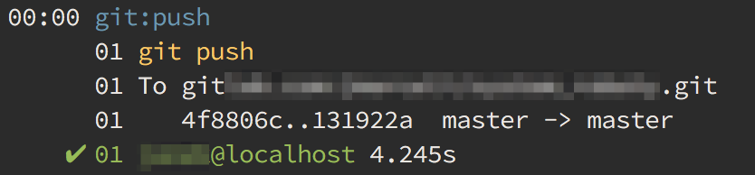

Writing and using custom Capistrano tasks is very easy and automating your deployment process may save you a lot of time and troubles. Here is a brief description of the creation process with a simple example at the end.

## Define your custom Capistrano tasks

The best place to store your custom tasks is the default `lib/capistrano/tasks/` directory where each task should have its own file. Task filename doesn't matter because by default Capistrano loads all files from the `lib/capistrano/tasks/` directory.

> Loading custom tasks should be handled by the default `Capfile` in the last line:

>`Dir.glob("lib/capistrano/tasks/*.rake").each { |r| import r }`

As you may noticed the task files should have a `.rake` extension (**not** `.rb`).

## Use your custom task in deployment process

After defining the task you may use it as a standalone Capistrano command e.g.

*run from console*
```bash
cap staging git:push
```
or add it to the deployment flow e.g.

*config/deploy.rb*
```ruby
before :deploy, 'git:push'
```
If you want to extend your deployment flow you should check the official Capistrano docs about [the Flow](http://capistranorb.com/documentation/getting-started/flow/) where you can find detailed description of available hooks. Each hook may be used with `before` or `after` keyword.

## Example Capistrano custom task: git push
This will be an example of a custom Capistrano task which will push your latest commits to the remote Git repository before the Capistrano deployment. In order to make it work properly, you should setup the `git remote origin` (which you probably have if you use the Capistrano).

### Create the task file
As I mentioned earlier it might be named as you wish, but I would suggest giving meaningful names to ease the maintenance. A filename which is the same as the namespace seems to be a fine idea.

*lib/capistrano/tasks/git.rake*
```ruby
namespace :git do
  desc 'Pushing new commits to the remote repository'
  task :push do
    on roles(:all) do
      run_locally do
        execute "git push"
      end
    end
  end
end
```

Instructions used in this example:

- **namespace** - will be used for referencing the task (`:git` is probably not the best choice as it may collide with some existing namespace)
- **desc** - is the task description which will be displayed after executing `cap -T`
- **task** - name of the task
- **roles** - used for limiting the execution only to the given **roles** (check the [role filtering](http://capistranorb.com/documentation/advanced-features/role-filtering/))
- **run_locally** - forces local execution, without that block the command defined after **execute** will be executed remotely on the deployment server
- **execute** - execute given command "from the console"

### Add task to your deployment flow
Append the following line to your *config/deploy.rb* file:

*run from console*
```ruby
before :deploy, 'git:push'
```

### Test the custom Capistrano task
In order to test your task, you may execute new command directly from the console. In this case it would be:

*run from console*
```bash
cap staging git:push
```

Where **staging** is your environment name, which of course doesn't matter in that example, but may be important for other tasks e.g. if the task restarts your app.

Finally try to start your deployment process with a regular command.

*run from console*
```bash
cap staging deploy
```

You should see the following message at the beginning of your deploy log output:



Which means that your remote git repository was updated before starting any other Capistrano deployment related operations (which is generally a useful feature).


For more info check the [Official Capistrano docs](http://capistranorb.com/).
