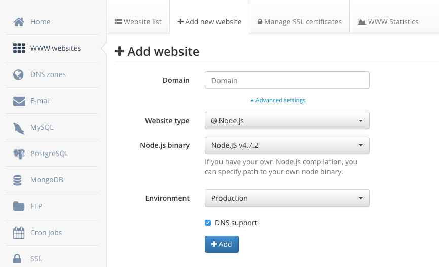

Ghost is an awesome blogging platform, but there is one "problem", it is written in Nodejs which is not so widely supported (as PHP) among a shared hosting platforms. Here is how to setup **Ghost** blog (and probably any other Node.js app) if you are on **mydevil.net**.

1. Log in to an admin interface and create a new website in _WWW websites_ menu.

- _Website type_ select Node.js
- _Node.js binary_ select one which suits your needs (in the time of writing it is `4.7.2`)
- click _+Add_ button

2.  Upload Ghost files to the `public_nodejs/ghost` directory inside your domain folder (you will have to create `ghost` subfolder) and install Ghost there. During installation process follow the official documentation [Installing Ghost on Linux](http://support.ghost.org/installing-ghost-linux/). A full path for your `ghost` directory would usually look like this:

        /home/[username]/domains/[yourdomain.com]/public_nodejs/ghost

Creating `ghost` subfolder is optional and I've done it just in order to keep `public_nodejs` folder clean. By default, it contains `public` and `tmp` subfolders which I didn't touch.

3.  The only _tricky_ step is to create entry "script" for your blogging app. According to the official [mydevil docs](https://wiki.mydevil.net/Nodejs) about Nodejs apps it is enough to create simple `app.js` file directly inside `public_nodejs` directory. This file should be an entry point for running your app, so in this case `app.js` may have only one line:

        require('./ghost/index.js'); // provided that you install Ghost in a `ghost` subdirectory

4) That's it. The work is done. Now access `http://yourdomain.com/ghost` to setup your admin account.
