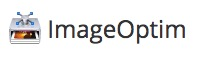

This will be a list of some most useful Mac Apps which I've installed recently.

## ImageOptim

Handy small App which compresses image files (e.g. makes cool progressive JPEGs). See https://imageoptim.com for more info.
