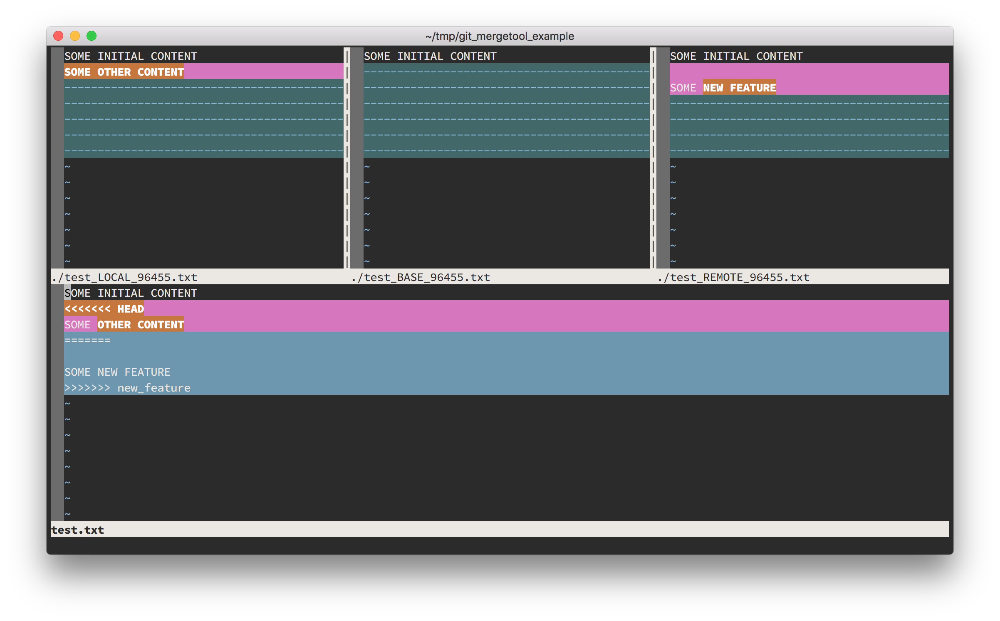
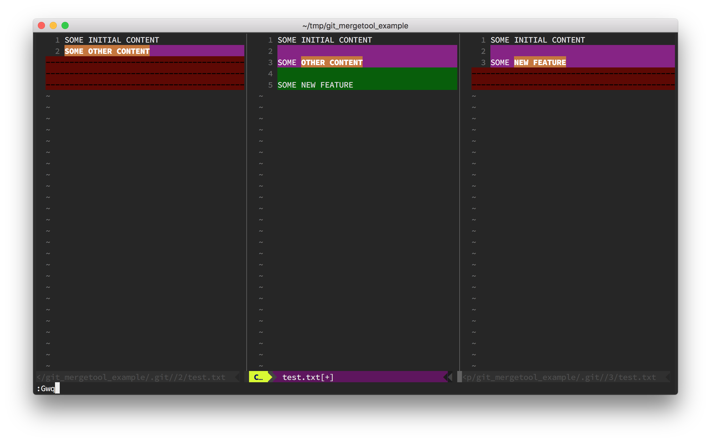
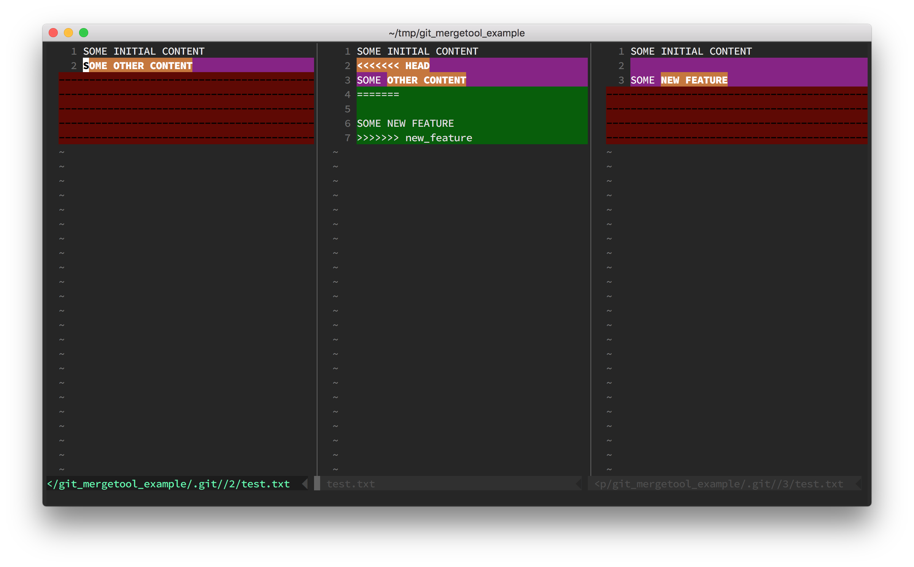
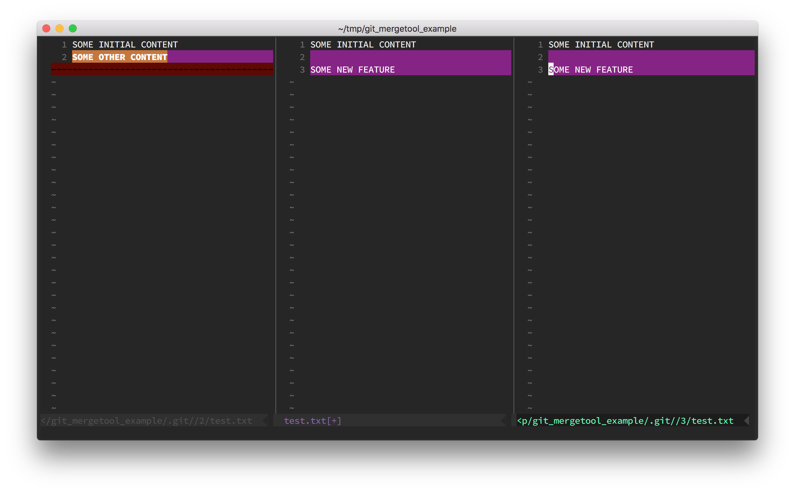

The "ugly" 4 window view of the default `vimdiff` configuration can scare you out even if you were using Vim for a while. It's just too much information for most of the common merge cases.

## Problem

How to configure **vim** or **nvim** (Neovim) with **git** to get a comfortable merge tool experience?

Not 4 windows...


## Solution

Install [vim-fugitive](https://github.com/tpope/vim-fugitive) plugin and put following configuration in your global `~/.gitconfig` file:

```
# define command which will be used when "nvim" is set as a merge tool
[mergetool "nvim"]
  cmd = nvim -f -c \"Gdiffsplit!\" \"$MERGED\"
# set "nvim" as tool for merging
[merge]
  tool = nvim
# automatically launch merge tool without displaying a prompt
[mergetool]
  prompt = false
```

(Thanks Kristijan for sharing updated `cmd` version for latest vim-fugitive plugin version)

It will give you a "nice" view with 3 windows horizontal split.



On the left side you have a current working copy (LOCAL).
On the right side you can view the remote (merged) file (REMOTE).
The central part of your screen shows a result (MERGED).

What is good about that setup (and why I use it all the time)?

1. In Vim **normal** mode place the cursor inside a right window in a merge conflict section (it is marked with a violet/pink highlight).
   
2. Hit the keys **dp** (a shortcut from `:diffput`).
3. Code under the cursor will replace conflicted part in the MERGED file.
4. Conflict solved, you are good to go.
   
   Repeat above steps for all merge conflicts (if you have more of them). You can navigate between left (LOCAL) and right (REMOTE) windows making diffputs to MERGED file as well as making manual changes directly inside merged content.

## Hints

You may execute `:Gw!` command in any of the opened windows. The window where you execute that command will be commited and marked as a merge resolution. It is very useful if you want to use just REMOTE or just LOCAL version without any further merge resolution steps.

Want more?
When in the central window use `d2o` or `d3o` to pull changes from LOCAL or REMOTE file.

## Notes

If you are using a legacy version of vim-fugitive plugin replace given CMD with its old version.

```
cmd = nvim -f -c \"Gdiff\" \"$MERGED\"
```

## Links

Where does it come from? Check out this tutorial if you would like to know the details

- http://vimcasts.org/episodes/fugitive-vim-resolving-merge-conflicts-with-vimdiff/ - Vimcasts are great source of Vim related knowledge
- https://neovim.io/ - awesome NeoVim project
- https://github.com/tpope/vim-fugitive - vim-fugitive docs
