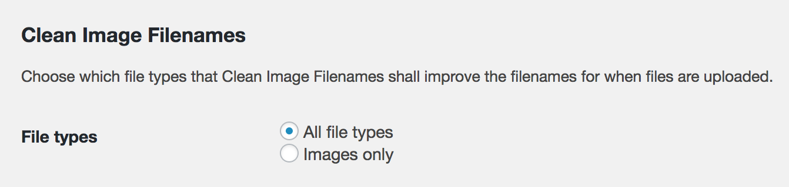

This is a list of useful Wordpress plugins which I use in my projects. Each plugin will have a short description in which I would try to justify its usage. I'm writing from a developer point of view so if you are a regular Wordpress user some of the plugins mentioned below may not be useful for you.

## clean-image-filenames
https://wordpress.org/plugins/clean-image-filenames/

This will enforce correct file names, without any weird language specific letters. This is the problem especially for the Safari PDFs which seems to be broken when the filename contains any letters like ą, ę, and others. What is more, this plugin will also take care of white spaces in a filename and normalize letters to make all of them lowercase.

Just don't forget to enable it for **All file types**:

**NOTE** The configuration is placed inside *Settings > Media* tab which might be not so obvious.

Switching from the default **Images only** to **All file types** is one of the first things I do when starting a new Wordpress project.
Clean Images Filenames plugin supports running from *mu-plugins/* folder which is also a useful feature as it saves a few moments required for manual activation.

## fly-dynamic-image-resizer
https://wordpress.org/plugins/fly-dynamic-image-resizer/

One of my recent findings. A very handy plugin if your theme should support a wide range of image sizes e.g. for nice theme responsiveness. Of course, it is only useful if you are developing your own custom theme.

Fly Dynamic Image Resizer will also run smoothly from *mu-plugins/* directory.

## svg-support
https://wordpress.org/plugins/svg-support/

This is perfect plugin if you want to upload SVGs to the gallery and use it in your posts. What is more, by adding `style-svg` CSS class to the `` element you may dynamically inline SVGs in a custom theme. The main advantage of this feature is the ability to style such inlined SVG with the CSS, so it's possible to apply CSS transitions to the SVG image!

## advanced-custom-fields (advanced-custom-fields-pro)
https://wordpress.org/plugins/advanced-custom-fields/

My favorite "custom fields" plugin especially thanks to the great documentation and nice [PHP API](https://www.advancedcustomfields.com/resources/register-fields-via-php/) which allows defining fields directly in code (without clicking and wasting time in admin panel). The PRO version, which is not free, is even more awesome, because of the new field types provided (IMO worth every penny).

TO BE CONTINUE...

TODO: check the https://wordpress.org/plugins/wp-smushit/ (mixed feelings because the images after optimization has slightly different colors than before)

GTmetrix service shows great improvement in "Optimize images" statistics from F(15) to A(96). So this plugin might be a nice option for sites where image colors are not so important.

TODO: check the https://www.gravityhelp.com/documentation/article/api-functions and find out if Gravityforms has a decent PHP API (like ACF)
