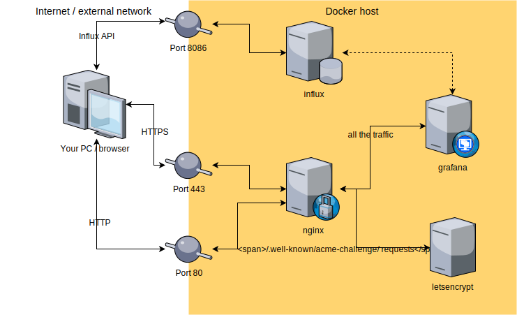

It seems extremely easy to do if you know all required Docker containers, but it's not so obvious if you are not a fluent Docker user.

## Update!
Despite the fact that LE will automatically regenerate certificate files there is no way (which I'm aware of) to trigger Influx container restart in order to use regenerated certificate files. The only workaround is setting `REUSE_PRIVATE_KEYS=true` environment variable for **letsencrypt** container. See updated post for more details.

Here is what it takes to create SSL secured **Grafana + InfluxDB** Docker setup:

- Grafana (https://hub.docker.com/r/grafana/grafana/)
- InfluxDB (https://hub.docker.com/_/influxdb/)
- Nginx-proxy (https://hub.docker.com/r/jwilder/nginx-proxy/)
- Let's Encrypt Nginx-proxy companion (https://hub.docker.com/r/jrcs/letsencrypt-nginx-proxy-companion/)

The additional benefit of this setup is certificate autogeneration and auto-renewal (no more worries/downtime related to expired Let's Encrypt certificate.

Required tools:

- docker (https://www.docker.com/)
- docker-compose (https://docs.docker.com/compose/install/ eases multi-container setup and removal operations)

## Spoiler
Create **docker-compose.yml** file with the content similar to the example below and execute **docker-compose up -d** command in the directory where your **yml** file is saved.
Here is the example content of **docker-compose.yml** with some comments related to the required modifications/adjustments (don't worry about the file length, feel free to skip this section and continue reading starting from Architecture description):

```yaml
version: '2'

services:
  grafana:
    image: grafana/grafana:5.0.0 # or probably any other version
    container_name: grafana
    restart: always
    environment:
      - VIRTUAL_HOST=YOUR.DOMAIN.TEST # adjust to match your domain name
      - VIRTUAL_PROTO=https
      - VIRTUAL_PORT=3000
      - LETSENCRYPT_HOST=YOUR.DOMAIN.TEST # adjust to match your domain name
      - LETSENCRYPT_EMAIL=YOUR.EMAIL@ADDRESS.TEST # adjust to match your email

      - GF_SERVER_CERT_FILE=/etc/letsencrypt/certs/YOUR.DOMAIN.TEST.crt # adjust to match your domain name
      - GF_SERVER_CERT_KEY=/etc/letsencrypt/certs/YOUR.DOMAIN.TEST.key # adjust to match your domain name
      - GF_SERVER_PROTOCOL=https

      - GF_SERVER_DOMAIN=YOUR.DOMAIN.TEST # adjust to match your domain name
      - GF_SECURITY_ADMIN_USER=SECURE_USERNAME # adjust to create Grafana admin account
      - GF_SECURITY_ADMIN_PASSWORD=SECURE_PASS # adjust to set Grafana admin password
    volumes:
      - ./letsencrypt/certs:/etc/letsencrypt/certs:ro

      - grafana-data:/var/lib/grafana

  influx:
    image: influxdb:1.4.2 # or any other recent version
    container_name: influx
    restart: always
    volumes:
      - influx-data:/var/lib/influxdb

      - ./letsencrypt/certs:/etc/letsencrypt/certs:ro
    ports:
      - "8086:8086"
    environment:
      # might be used someday when issue #59 will be resolved/merged
      #- VIRTUAL_HOST=YOUR.DOMAIN.TEST:8086
      #- VIRTUAL_PROTO=https
      #- VIRTUAL_PORT=8086

      - INFLUXDB_HTTP_HTTPS_ENABLED=true
      - INFLUXDB_HTTP_HTTPS_CERTIFICATE=/etc/letsencrypt/certs/YOUR.DOMAIN.TEST.crt # adjust to match your domain name
      - INFLUXDB_HTTP_HTTPS_PRIVATE_KEY=/etc/letsencrypt/certs/YOUR.DOMAIN.TEST.key # adjust to match your domain name

      - INFLUXDB_DB=SOME_DB_NAME # set any other to create database on initialization
      - INFLUXDB_HTTP_ENABLED=true
      - INFLUXDB_HTTP_AUTH_ENABLED=true

      - INFLUXDB_ADMIN_USER=SECURE_USERNAME # adjust to create InfluxDB admin account
      - INFLUXDB_ADMIN_PASSWORD=SECURE_PASS # adjust to create InfluxDB admin password

  # Containers below ensures automatic cert creation and renewal
  nginx:
    image: jwilder/nginx-proxy:0.6.0
    container_name: nginx
    restart: always
    labels:
      - com.github.jrcs.letsencrypt_nginx_proxy_companion.nginx_proxy
    ports:
      - "80:80"
      - "443:443"
    volumes:
      - /var/run/docker.sock:/tmp/docker.sock:ro
      - ./nginx/html:/usr/share/nginx/html
      - ./nginx/vhost.d:/etc/nginx/vhost.d
      - ./letsencrypt/certs:/etc/nginx/certs:ro
  letsencrypt:
    image: jrcs/letsencrypt-nginx-proxy-companion:v1.7
    container_name: letsencrypt
    restart: always
    volumes_from:
      - nginx
    volumes:
      - ./letsencrypt/certs:/etc/nginx/certs:rw
      - /var/run/docker.sock:/var/run/docker.sock:ro
    environment:
      - REUSE_PRIVATE_KEYS=true

volumes:
  influx-data:
    driver: local
  grafana-data:
    driver: local
```

That's all. Just replace:

- **YOUR.DOMAIN.TEST**  - appropriate domain name
- **YOUR.EMAIL@ADDRESS.TEST** - your email address
- **SECURE_USERNAME** - some username
- **SECURE_PASS** - secure password for the user

After executing **docker-compose up -d** you SSLed **Grafana + Influx** stack should be available over **https://YOUR.DOMAIN.TEST** and **https://YOUR.DOMAIN.TEST:8086**. It may take a couple of minutes on the first run because of Let's Encrypt certificate generation.

As an "extra" benefit the Nginx ensures [HSTS headers](https://en.wikipedia.org/wiki/HTTP_Strict_Transport_Security) for SSLed service, which basically means that all requests have to be done using an encrypted connection (the browser will force `https://` at the beginning of the address).

## Architecture

As we know by default Docker creates it's own subnetwork for running containers and communication between them. Here is how it looks in the above example.



**NOTE 1: Influx URL**.
Inside Grafana data sources panel you will have to define your Influx URL using a fully qualified domain name ([FQDN](https://en.wikipedia.org/wiki/Fully_qualified_domain_name) e.g. https://YOUR.DOMAIN.TEST:8086) and not internal Docker subnetwork alias e.g. influx. This is due to the fact that SSL certificate will work with Influx only if it is accessed through the URL for which certificate was requested.

**NOTE 2: Grafana port**. In this setup Grafana still uses its default 3000 port, the redirection from 80 and 443 ports is handled by the Nginx proxy server.

**NOTE 3: Influx without proxy**. As you may notice InfluxDB connections doesn't go through Nginx. That fact is caused by the Nginx env variables configuration limitation. It doesn't allow to specify port-based routing (only subdomain routing is available). For more details please refer to the [Github issue #59](https://github.com/jwilder/nginx-proxy/issues/59)

## Detailed description

Here is some more information about setup presented above. Some of them may be evident especially for (more or less) experienced Docker users. I think that they are worth at least skimming through.

### container_name

The container name option, once specified, let's you refer to the deployed container using a custom name instead of SHA code. It is useful especially for checking container status with `docker logs [container_name]` or executing custom commands with `docker exec -it [container_name]`.

### restart: always

Just to ensure continuous work even after Docker/host restart. Be careful with **restart: unless-stopped** as this option lacks the container autostart feature.

### labels

They are used (in this setup) just to mark which container is the Nginx proxy in order to trigger its reloading on certificate update. It's a handy feature implemented by **letsencrypt-nginx-proxy-companion**.

### /var/run/docker.sock:/var/run/docker.sock:ro

That's a tricky one. The **docker.sock** allows the container to work with [Docker Engine API](https://docs.docker.com/engine/api/v1.36/). It is used by the **jwilder/nginx-proxy** to do its **VIRTUAL_...** env variables magic. The docker API works similar to any JSON based HTTP API, but it is exposed on **docker.sock** socket.

### :ro and :rw suffixes

I think it's an obvious one but to cover "everything" I can say that those are folder/file permissions: "**R**ead **O**nly" and "**R**ead and **W**rite".

### volumes

There are 3 kinds of "paths" used in this setup:

- absolute paths like **/var/run/docker.sock:...** which points to the host system internal files
- relative paths e.g. ***./letsencrypt/certs:...** which are a handy way of storing/sharing container files with the host system
- volumes dirs **influx-data:...** these are used for ensuring data persistence ensured by the Docker

### cert files

Don't worry that the cert file paths are invalid on the first run when there are no certificate files. As soon as Let's Encrypt certificate request will be fulfilled you will find appropriate certificates in the specified localizations.

### REUSE_PRIVATE_KEYS

This option passed to the letsencrypt container via environment variables allows you to reuse same keys after 90 days expiry time. That's the only way to avoid manual restart of the **influx** container after certificates renewal (because of certificate file changes).

## Footnotes

That's all for now. I'd be happy to answer some questions. I hope to be able to explain everything about this or similar setup.
For testing SSL configuration you may use https://www.ssllabs.com/ssltest (thanks to @Kjetil Mjøs who remid me about this tool in one of his comments). The expected overall grade is **A+**.

## Question: How to add another Grafana instance on separate (sub)domain?

It should be fairly easy, just point your new (sub)domain at your existing Docker host and add following "section" to the **docker-compose.yml** file:

```yaml
#... existing docker-compose.yml content omitted for brevity
  grafana2: # just for clarification: this is a service name
    image: grafana/grafana:5.0.0 # or probably any other version
    container_name: grafana2
    restart: always
    environment:
      - VIRTUAL_HOST=ANOTHER.DOMAIN.TEST # adjust to match your domain name
      - VIRTUAL_PROTO=https
      - VIRTUAL_PORT=3000
      - LETSENCRYPT_HOST=ANOTHER.DOMAIN.TEST # adjust to match your domain name
      - LETSENCRYPT_EMAIL=YOUR.EMAIL@ADDRESS.TEST # adjust to match your email

      - GF_SERVER_CERT_FILE=/etc/letsencrypt/certs/ANOTHER.DOMAIN.TEST.crt # adjust to match your domain name
      - GF_SERVER_CERT_KEY=/etc/letsencrypt/certs/ANOTHER.DOMAIN.TEST.key # adjust to match your domain name
      - GF_SERVER_PROTOCOL=https

      - GF_SERVER_DOMAIN=ANOTHER.DOMAIN.TEST # adjust to match your domain name
      - GF_SECURITY_ADMIN_USER=SECURE_USERNAME # adjust to create Grafana admin account
      - GF_SECURITY_ADMIN_PASSWORD=SECURE_PASS # adjust to set Grafana admin password
    volumes:
      - ./letsencrypt/certs:/etc/letsencrypt/certs:ro

      - grafana2-data:/var/lib/grafana
```
Notable changes compared to direct "copy/paste" of existing **grafana** service:
- please remember to change service name and **container_name** to make them different from existing ones (**grafana2** in this example)
- every **YOUR.DOMAIN.TEST** is replaced with **ANOTHER.DOMAIN.TEST** (it might be **any** domain name which is pointed at your host, not necessarly a subdomain with common root domain e.g. **MYDOMAIN.TEST** will work as well)
- as you may noticed **LETSENCRYPT_EMAIL** doesn't require any changes as you may use one email for multiple domains
- in **volumes** section please remember to change **grafana-data** to any other volume (**grafana2-data** in my example), in other case your Grafana instances will share files (you probably don't want that)

You should also add volume mapping for a new Grafana instance at the end of **docker-compose.yml** (which was modified before) in **volumes** section append:
```yaml
#... existing docker-compose.yml content omitted for brevity
volumes:
  #... existing volumes omitted for brevity
  grafana2-data:
    driver: local
```

That's it.
Now execute:
```bash
docker-compose up -d
docker-compose restart
```
Docker should now run two independent Grafana instances on different (sub)domains.
