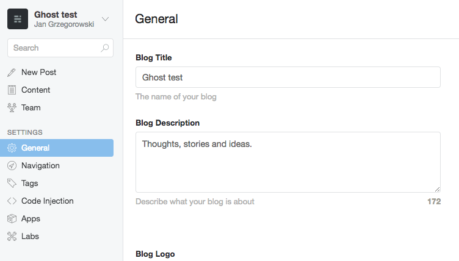
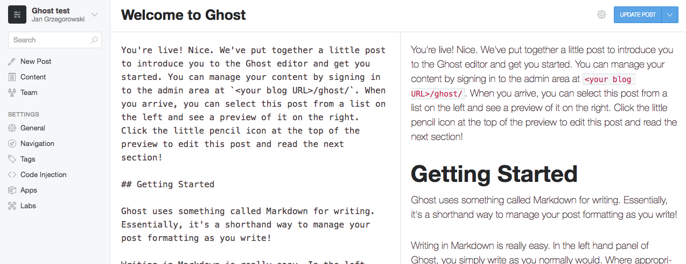

WordPress is an obvious choice if you want to write your own online blog. It is especially true if you are a WordPress developer which happens to be my case. Why would anyone bother to choose something else?

> [deprecation warning] This article was written for Ghost 0.x which is now considered to be a LTS version. For new blogs consider using Ghost 1.x.

Playing with new technologies is one of my favorite leisure activities so I decided to check out Ghost a modern solution for simple blogging websites. Here are some of my findings and impressions.

## Installation
In my opinion the only problem with Ghost installation is finding a suitable hosting provider. Nodejs support on a common shared hosting platforms in my country is still hard to get. Fortunately, my favorite one supports Nodejs out of the box and it is really easy to use. Just ["copy and paste" Ghost files](http://ghost.grzegorowski.com/setup-ghost-blog-on-mydevil-net/) according to the official documentation, comparing to the WordPress installation it doesn't seem to be much harder. After the installation process just access `http://yourdomain.com/ghost` URL and create an admin account. I was afraid that Nodejs app setup will be much more complicated.

## Admin panel
The admin panel of a Ghost, in my opinion, is extremely simple thanks to the fact that this is only a blogging platform and it doesn't try to be anything more. I doubt if anyone could have any problems with it.

## Editor
The only thing that might be confusing for non-technical users is the Editor. It is quite intuitive and has a cool feature of live preview but I'm afraid that for MS Word users Markdown concept might not be so obvious. I should probably check it with some of my clients.

**UPDATE** Regarding GitHub [issue](https://github.com/TryGhost/Ghost/issues/7429) that I found it seems that the Ghost v1.0 should be shipped with a brand new editor based on [mobiledoc kit](https://github.com/bustlelabs/mobiledoc-kit), which might be a smart move.

## Pros and cons
Standard section for every review-like content :)

On the plus side I would mention following points:

- fast & lightweight (works great on mobile and desktop)
- easy to use
- writing post with your mobile phone (or any other touch device) is not a nightmare (if you like writing in Markdown)

But there are some downsides:

- images are not auto compressed/resized so you have to be careful when uploading them (a photo from your camera without any preprocessing would be a disaster regarding its usual weight)
- mixing markdown with regular HTML is buggy so don't expect going out of Markdown limitations
- assets are not minified, probably using a good theme would solve that one, but the default theme "casper" serves raw JS and CSS which is kind of bandwidth waste

## Why I choose Ghost

All in all, I think that Wordpress gives me a lot more power over every aspect of the system, plenty of plugins for every occasion and is much more "complete", but running a blog on Ghost just gives "more fun". I mean writing in Markdown is easy, I'm a *Vim* enthusiast so I don't like leaving my keyboard home row to do some styling. Ghost speed gives me an illusion of using a native App (which is really nice), while limited options are "just enough" to get the job done if we are talking about running a blog.
