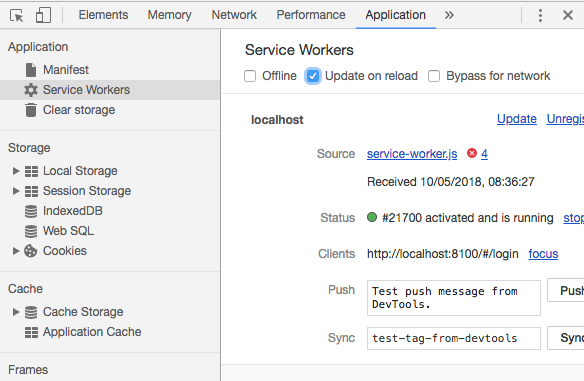

A solution for live reload "bug" while using [ionic-app-scripts](https://github.com/ionic-team/ionic-app-scripts) which causes showing old content after automatic page refresh.

If you are developing Ionic PWA (Progressive Web App) you may encounter this strange and annoying live reload bug. Your content is updated only after refreshing page manually after the live reload triggers first page refresh.

**This behavior may be caused by the Service Workers inside your browser!**

Just update them after each page reload by checking an option **Update on reload** in Google Chrome Developer Tools inside **Application > Service Workers**:

That should solve it, at least in my case that helps instantly.

## Sources
https://github.com/ionic-team/ionic-app-scripts/issues/825
https://github.com/ionic-team/ionic-app-scripts/issues/1432
https://github.com/ionic-team/ionic-app-scripts/issues/1132
and many more... (may or may be not related to that issue)
