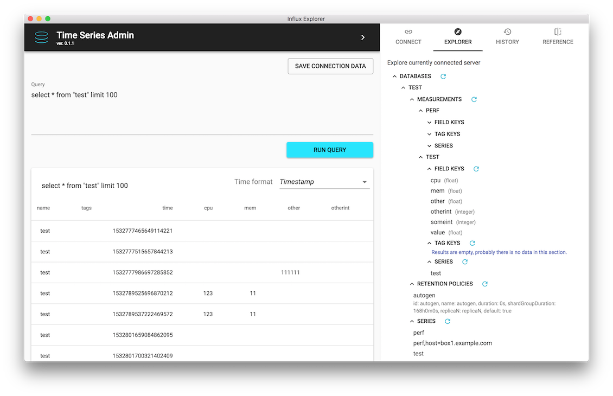
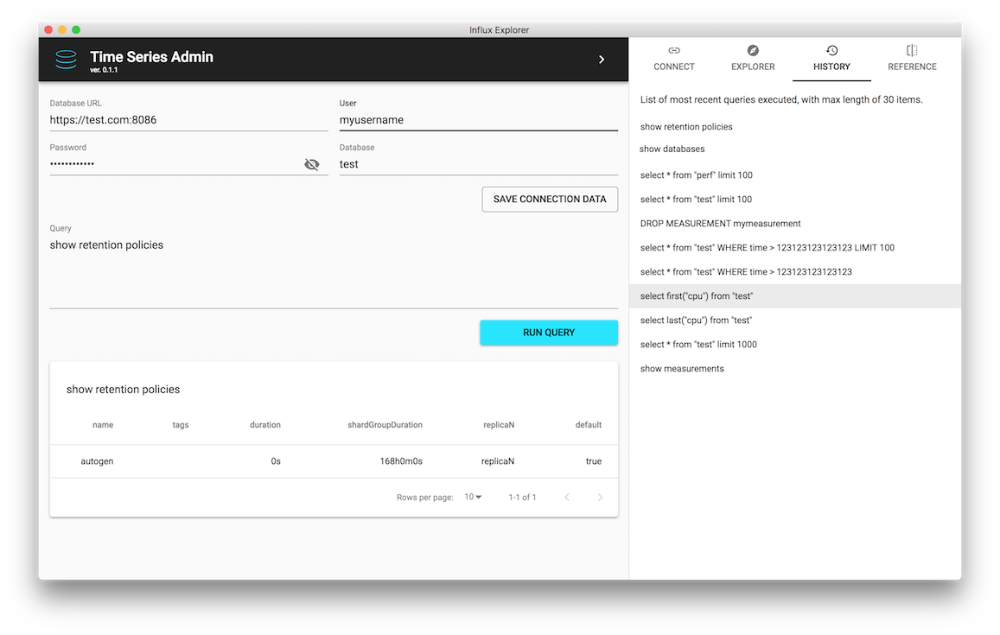

InfluxDB turns out to be a good solution for a time series data which happens to be the cornerstone of my current job. As (probably) every database it has it's pros and cons, but the most annoying thing for me as a developer was lack of a proper administration tool to work with.
Until now...
<br/>
<div style="text-align: center">
    <a href="https://timeseriesadmin.github.io/" style="box-shadow: none; display: inline-block;">
      
      <h3>Time Series Admin</h3>
    </a>
</div>
<br/>

## Quick start

Here it is [Time Series Admin](https://timeseriesadmin.github.io/), which you may [download](https://timeseriesadmin.github.io/#download) as an Electron application. It is built as an alternative to [deprecated Admin UI](https://docs.influxdata.com/influxdb/v1.3/administration/differences/#web-admin-ui-removal) or current [Chronograf](https://docs.influxdata.com/chronograf/v1.6/) based approach.

It is tested to be compatible with:

- Windows 10 x64
- Ubuntu 18.04
- Mac OS X 10.13

It should also work with other versions of popular OSes, but this is not yet verified (a feedback will be appreciated).

In order to ensure a fallback for non-supported OSes and for demo purposes there is also an [Time Series Admin Docker image](https://hub.docker.com/r/timeseriesadmin/timeseriesadmin/).
You may run it on (probably) any OS and use through some recent version of Google Chrome browser.
Everything you need to get it working is a [Docker installed](https://www.docker.com/get-started) on your system and a command:

```bash
docker run -p 8085:80 -it timeseriesadmin/timeseriesadmin:latest
```

After executing command above visit [http://localhost:8085](http://localhost:8085).

## Why

I know that there is [Grafana](https://grafana.com/) and Chronograf, but while these tools are great for plotting and presenting data they are not so convenient to explore and work with raw queries during development phase.
Here are some reasons which justifies existence of Time Series Admin as an administrator UI for InfluxDB:

- no need for server to run you administrator UI
- you are always one click away from any of your InfluxDB servers (easy access to any of saved connections)
- query history (this is something I was missing most in any other InfluxDB UI)
- ability to browse through Influx structure without worrying about queries
- viewing raw query results
- formatting returned data timestamps

## Overview

General idea was to create a tool (admin UI) which will work through InfluxDB HTTP API allowing for easy query execution and database management/exploration.

Time Series Admin is aimed primarily at developers/users who have at least base knowledge about [InfluxQL] (https://docs.influxdata.com/influxdb/v1.6/query_language/).
Thanks to the "Explorer" panel even without any knowledge you may reason about database internals in a human friendly way.



## Features

Most of the features are illustrated on the official Time Series Admin project page in [showcase](https://timeseriesadmin.github.io/#showcase) section.
Some of them are extremely helpful (like query history) and others are more or less irrelevant (references panel - at least in current version). Anyway here they are:

- query history
- results browsing, pagination, sorting
- time formatting
- connection credentials list (saving, loading and deleting them)
- server exploration (through the Explorer panel)
- detailed error reporting
- flexible window size
- query reference



## Further development - wish list of features

While Time Series Admin is a usable and fully functional tool there are some improvemenets that are currently in backlog and hopefully will be available in future versions:

- writing data directly from UI
- import/export data (e.g. in CSV format)
- query editor (with some kind of suggestions and autocorrection, maybe a query wizzard)
- users administration UI
- retention policy UI
- automatic/easy application updates
- more UI buttons in Explorer (e.g. drop measurement, preview data, count series etc.
- copy measurement data feature (through `SELECT ... INTO ...` query)
- connection params validation autocorrection (e.g. missing port number or invalid URL)

If you have any other ideas or feature request please let me know by creating an issue in the [project Github repository](https://github.com/timeseriesadmin/timeseriesadmin/issues/new).

## Summary

You are welcome to go and [try Time Series Admin](https://timeseriesadmin.github.io/#download).
As usually it is an open source project [hosted on Github](https://github.com/timeseriesadmin/timeseriesadmin) with MIT license.
If you find any issues during usage please report them directly on Github.

Of course you are more than welcome to contribute, more details about that should be available in repository files.
