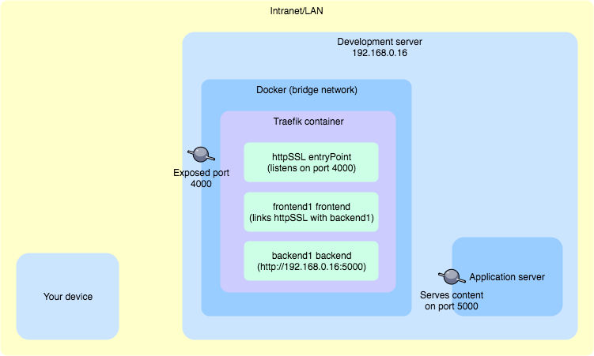
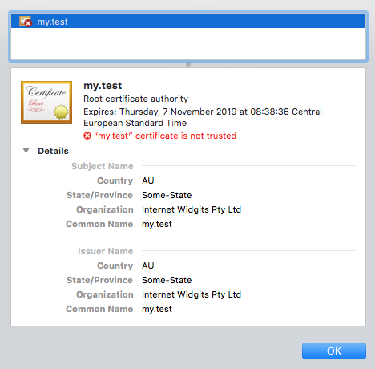

You want to check how (or if) your application works with SSL encryption without exposing it to the Internet? Use a self-signed SSL certificate with the Traefik proxy server inside the intranet (or other LAN with restricted access).

**TLDR;** Clone this repo and adjust content of **traefik.toml** file https://github.com/jmarceli/traefik-self-signed-ssl-proxy

## Start

[Traefik](https://docs.traefik.io/) is becoming more and more popular thanks to its configuration simplicity and rich features available out of the box. Here is how it can be used to ensure self-signed SSL certificate for selected application server.

### Overview



Things to check before starting:

- **Your device** - should have access to **Development server** using a custom domain name e.g. **my.test**, you can set it using the **/etc/hosts** file (on Unix systems), **dnsmasq** or directly in the network router, if you have access to its configuration (if you can't do that please read [#Tips](#tips) section to adjust your **traefik.toml** TLS configuration)
- **Development server** - if necessary, adjust system firewall configuration and open the required ports (ports **4000** and **8080** should be available for Intranet/LAN connections)
- **Application server** - make sure it works and is available from **Development server** on port **5000**

Request to **my.test:4000** made from **Your device** is supposed to go through the following path:

- access **Development server** (via some domain resolution mechanism e.g. **/etc/hosts** on **Your device**)
- go through opened **4000** port
- **Traefik** Docker container should handle that request thanks to the exposed **4000** port
- Traefik **httpSSL** entryPoint should be set to **4000** port and handle the request
- Traefik **frontend1** should "redirect" request to **backend1**
- Traefik **backend1** should respond with a content from **Application server**

### File structure

Here is the final files structure you should generate by following the next steps.

```bash
./
./certs/cert.crt
./crets/cert.key
./traefik.toml
./docker-compose.yml
```

### Self-signed certificate files

You will need a **.key** and **.crt** files. They can be generated for self-signed certificates using the `openssl`. If you don't have it already, please check on Google (`brew install openssl` for Mac OS X with Homebrew packages manager). With the `openssl` ready to use execute:

```bash
openssl req -x509 -nodes -days 365 -newkey rsa:2048 -keyout cert.key -out cert.crt
```

The only important question while running the `openssl` command is **Common Name (e.g. server FQDN or YOUR name):**. It should match the domain name of your server e.g. `*.test` or `my.test` (or any other that you can point to your server), wildcards (`*`) are allowed.

After preparing the certificate files, you must change their access rights.

```bash
chmod 644 cert.crt
chmod 600 cert.key
```

It's done, now you may proceed to the next step.

### Traefik configuration traefik.toml

Most Traefik configurations will be placed inside the **traefik.toml** file. Here is the final result.

```toml
debug = true
logLevel = "DEBUG"
defaultEntryPoints = ["httpSSL"]

[web]
address = ":8080"

[entryPoints]
  [entryPoints.httpSSL]
  address = ":4000"
    [entryPoints.httpSSL.tls]

[file]

[backends]
  [backends.backend1]
    [backends.backend1.servers]
      [backends.backend1.servers.server0]
        url = "http://192.168.0.16:5000"

[frontends]
  [frontends.frontend1]
  entryPoints = ["httpSSL"]
  backend = "backend1"

[[tls]]
  entryPoints = ["httpSSL"]
  [tls.certificate]
    certFile = "/certs/cert.crt"
    keyFile = "/certs/cert.key"
```

Useful information:

- **debug** and **logLevel** - It should be self-explanatory
- **defaultEntryPoints** - Specifies that by default Traefik server will expose extrypoint named **httpSSL** (it can be **any** string, just be consistent if you want to change it)
- **[web]** - This section might be omitted, it will provide administrative/diagnostic panel on the selected **8080** port
- **[entryPoints]** - Defines default entrypoint **httpSSL** and assings port **4000** to it. It also ensures **tls** encryption ([TLS is "safer" SSL](https://tools.ietf.org/html/rfc7568))
- **[file]** - This one is tricky, because it does not look as important as it is, thanks to that section Traefik uses **traefik.toml** [file as a backend definitions provider](https://docs.traefik.io/v1.5/configuration/backends/file/)
- **[backends]** - All available backends names (which is only one **backend1** in this example) with **http://192.168.0.16:5000** as a proxy target (**http://192.168.0.16:5000** is an IP address of a running Application server)
- **[frontends]** - Frontends configuration, where **frontend1** is the name (which can be changed at any time), **entryPoints** and **backend** keys link entry point with a backend for given frontend, **rule** tells Traefik which domains it should handle with that frontend
- **[[tls]]** - Assign generated cert and key files to the selected **entryPoint** (which is **httpSSL** in this case)

### It's Docker time

With **traefik.toml** in place it's time to go to the Docker configuration. The simplest (at least for me) solution is to write the **docker-compose.yml** file. Here's how it can look.

```yaml
version: '3'

services:
  traefik:
    image: traefik:1.7.0
    networks:
      - public
    ports:
      - 4000:4000
      - 8080:8080
    volumes:
      - ./traefik.toml:/traefik.toml
      - ./certs/:/certs/
      - /var/run/docker.sock:/var/run/docker.sock

networks:
  public:
    driver: bridge
```

Let's start from the beginning:

- **version** - Specifies the syntax of the Docker configuration used
- **services** - A list of Docker containers to create
- **traefik** - The only service to create
- **image** - Image for **traefik** service creation (**1.7.0** is the current stable version at the time of writing)
- **network** - The name of the network which will be used does not matter, as long as it uses the **bridge** driver defined at the end of configuration in **networks** section
- **ports** - Exposes **4000** port which will be proxied with SSL and **8080** for debugging and diagnostic
- **volumes** - Files and folders mounted to the created container, you should be familiar with all of them except **/var/run/docker.sock** which allows **traefik** container to [use Docker API](https://stackoverflow.com/questions/35110146/can-anyone-explain-docker-sock/35110344)

### Show time

When everything is in place, it's easy to shine :)
Execute:

```bash
docker-compose up
```

Visit http://192.168.0.16:8080 to check the configuration. Here is how it may look like.


Then open https://my.test:4000 to admire the results of your hard work.

You can verify if certificate works by clicking on "Not Secure" info in Google Chrome address bar. Details should match those provided during cert generation.



## Tips

### You can't set a custom domain name for your development server and you need to use it's IP address

Use following **entryPoints** configuration:

```toml
[entryPoints]
  [entryPoints.httpSSL]
  address = ":4000"
    [entryPoints.httpSSL.tls]
    [entryPoints.httpSSL.tls.defaultCertificate]
      certFile = "/certs/cert.crt"
      keyFile = "/certs/cert.key"
```

Thanks to that step you will use your own certificate (generated in [#Self-signed certificate files](#self-signed-certificate-files) step) as a default one.

### Application server address 192.168.0.16

It doesn't have to be your Development server IP visible on LAN. It can be also an internal IP visible from Docker which is usally something like **172.17.0.1**. You should be able to check that using **ifconfig** (look for **docker0** interface), in case you are using **Docker for Mac** you may also use **host.docker.internal** [see the docs](https://docs.docker.com/docker-for-mac/networking/#use-cases-and-workarounds).

## Troubleshooting

Check the output after executing the `docker-compose up` command.

If you want to restart the created container with the new/changed configuration inside **traefik.toml** file, press `Ctrl-c`, and then execute `docker-compose down && docker-compose up` to make sure that old container has been properly destroyed.

`502 Bad gateway` instead of your requested/proxied content probably means that you have made a simple error in the **traefik.toml** configuration. Watch out for typos and renaming (if you choose to change some names).

Start with minimal modifications. Just copy and paste the example content to files and adjust only the URLs. Start it. You will be renaming everything (frontends, backends, entryPoints, containers, networks etc.) later, after the first successful start.

Some explanations regarding the Traefik log messages:

- `Serving default cert for request: ...` - you probably give an incorrect FQDN when generating a self-signed certificate using `openssl`
- `Error loading new configuration, aborted unable to generate TLS certificate : tls: failed to find any PEM data in certificate input` - check the path to your certificate files specified in the **traefik.toml** file, it is probably icorrect

Be patient and read this guide again... (if necessary)

## Why

Because I did not find such an example when I needed it.

After some adjustment, you can use this configuration in production with Let's Encrypt SSL certificate instead of self-signed. I'm going to write something about it later and link it here.

## Sources
https://tools.ietf.org/html/rfc7568 - SSLv3 deprecation in favour of TLS 1.2
https://stackoverflow.com/questions/35110146/can-anyone-explain-docker-sock/35110344 - info about docker.sock
https://hub.docker.com/_/traefik/ - Traefik Docker image
https://docs.traefik.io/ - Traefik Documenation, which should be the most up-to-date source of knowledge
https://docs.docker.com/docker-for-mac/networking/#use-cases-and-workarounds - Docker docs
