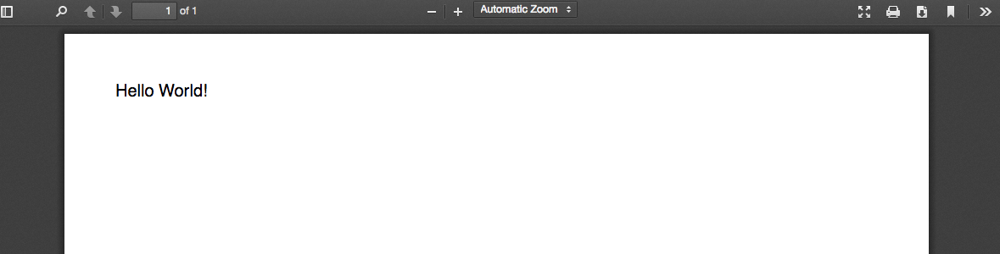
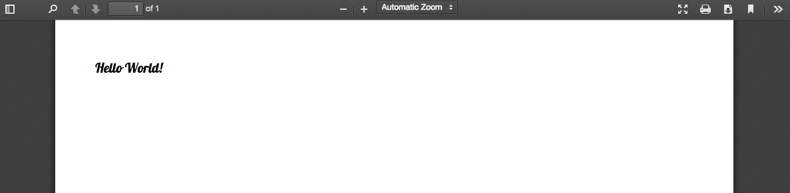

During my recent project development, I came across a problem of generating PDFs. Fortunately, there is a nice gem for creating PDF documents with Ruby which is named [Prawn](https://github.com/prawnpdf/prawn). In a few lines below, I would like to explain how to use it with Rails 5. This will be just a minimal example with **Hello World!** document as a result.

## 1. Install Prawn gem:
Please check out what is the current gem version on [RubyGems.org](https://rubygems.org/gems/prawn) or [Github](https://github.com/prawnpdf/prawn/releases) and add similar line to your `Gemfile`:


<span class="filepath">**Gemfile**</span>
```ruby
gem 'prawn', '~>2.2.0'
```

## 2. Extend one of your actions
Add `format.pdf` to one of your controllers. In my case it was `export_controller` but the name is irrelevant here. Just pick one of the actions e.g. `show` and inside `respond_to do |format|` block generate a PDF. Example:

<span class="filepath">**app/controllers/export_controller.rb**</span>
```ruby
class ExportController < ApplicationController
  def show
    respond_to do |format|
      // some other formats like: format.html { render :show }

      format.pdf do
        pdf = Prawn::Document.new
        pdf.text "Hellow World!"
        send_data pdf.render,
          filename: "export.pdf",
          type: 'application/pdf',
          disposition: 'inline'
      end
    end
  end
end
```
That's it. Now when you visit correct URL with `.pdf` at the end you will see (or download) generated PDF file. In my case the URL in question is `http://localhost:3000/export/show.pdf`.

But there is more!

## 3. PDF development
During the development, it is nice to have an easy way to preview the changes that you made. If you are using Google Chrome browser (as I do) you may notice that instead of opening PDFs inline the files are immediately downloaded. This is very inconvenient behavior if you are constantly changing your code and try to preview those changes.
Luckily, the solution is quite easy, just install a PDF preview plugin/extension. I choose [PDF Viewer](https://chrome.google.com/webstore/detail/pdf-viewer/oemmndcbldboiebfnladdacbdfmadadm?hl=en) but you can install any other if you want. The point is that you should now be able to go to `http://localhost:3000/export/show.pdf` and view the PDF inline (as defined by the `disposition` in the example code) and refresh this preview just by hitting *cmd+r* (or *F5* on Windows).
This will be a huge improvement comparing to the downloading a file and then opening it.

## 4. PDF class
Code provided in step **2.** as a minimal example suffers from combining a controller code with an actual PDF document generation which will become an issue when the code for generating PDF grows. Here is one of the possible solutions.

Create a separate class.

<span class="filepath">**app/pdfs/export_pdf.rb**</span>

```ruby
class ExportPdf
  // `include` instead of subclassing Prawn::Document
  // as advised by the official manual
  include Prawn::View

  def initialize
    content
  end

  def content
    text "Hello World!"
    // here comes more code for generating PDF content
    // ...
  end
end
```

Use this class inside your controller

<span class="filepath">**app/controllers/export_controller.rb**</span>
```ruby
class ExportController < ApplicationController
  def show
    respond_to do |format|
      // some other formats like: format.html { render :show }

      format.pdf do
        pdf = ExportPdf.new
        send_data pdf.render,
          filename: "export.pdf",
          type: 'application/pdf',
          disposition: 'inline'
      end
    end
  end
end
```

**NOTE**: There is no need to change anything more to autoload `app/pdfs/` classes. Just restart your development Rails server after adding `app/pdfs/export_pdf.rb` file. The folder will be autodetected and all the classes autoloaded.

## 5. Custom Google Font with Prawn gem
At some point you will probably want to have a custom font for PDFs generated by your application. It's quite easy if you know how to do that.

First of all download font that you want to use from [Google Fonts](https://fonts.google.com/) for example [NotoSans](https://fonts.google.com/specimen/Noto+Sans). Then extract downloaded zip file to the Rails vendor directory <span class="filepath">**vendor/assets/fonts/**</span>  so the file paths for the font files will be e.g. <span class="filepath">**vendor/assets/fonts/NotoSans-Regular.ttf**</span>, <span class="filepath">**vendor/assets/fonts/NotoSans-Italic.ttf**</span> etc.

Now you should tell Prawn that you want to use selected custom font. Your code should look as follows if you use a separate class for PDF generation as described in [#4](#4pdfclass) (added lines/methods has some comments):

<span class="filepath">**app/pdfs/export_pdf.rb**</span>
```ruby
class ExportPdf
  include Prawn::View

  def initialize(data)
    font_setup # this is a new line
    content
  end

  # This is the new method with font declaration
  def font_setup
    font_families.update("NotoSans" => {
      :normal => "vendor/assets/fonts/NotoSans-Regular.ttf",
      :italic => "vendor/assets/fonts/NotoSans-Italic.ttf",
      :bold => "vendor/assets/fonts/NotoSans-Bold.ttf",
    })
    font "NotoSans"
  end

  def content
    text "Hello World!"
  end
end
```

Now you should have a custom font for your PDF. Here is the result:

and another with a [Lobster](https://fonts.google.com/specimen/Lobster) font (to show the difference):


Of course, this method will work for any kind of custom font if you have appropriate **.ttf** files.

## Hints
In order to get document width (inner width without margins) use:
```ruby
bounds.width
```
This will work **inside** class which includes **Prawn::View**.

## Issues encountered
Some of the errors which I have to solve during the **prawn gem** usage:

- *Prawn::Errors::IncompatibleStringEncoding*

  It turns out that using LatinExtended charset letters like ę, ą and others requires using a custom font as described in [#5](#5customgooglefontwithprawngem)


For more info about Prawn gem capabilities please refer to the official documentation http://prawnpdf.org/api-docs/2.0/ and especially to the manual http://prawnpdf.org/manual.pdf where all methods are described with examples.

---
Sources:

- https://rubyplus.com/articles/3891-PDFs-with-Prawn-in-Rails-5
- http://railscasts.com/episodes/153-pdfs-with-prawn?view=asciicast
- https://www.sitepoint.com/pdf-generation-rails/
