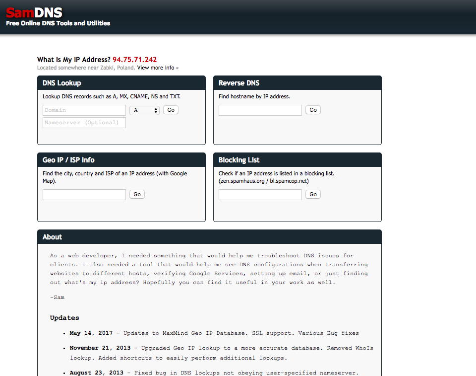
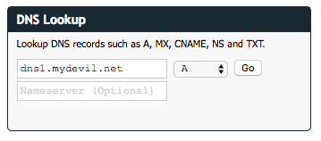
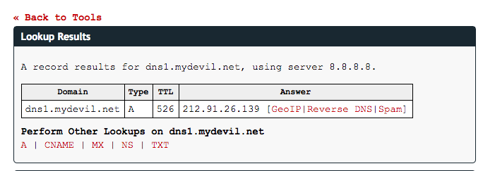
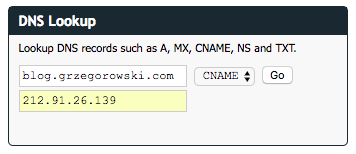
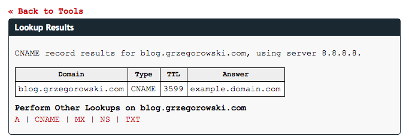
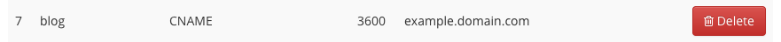
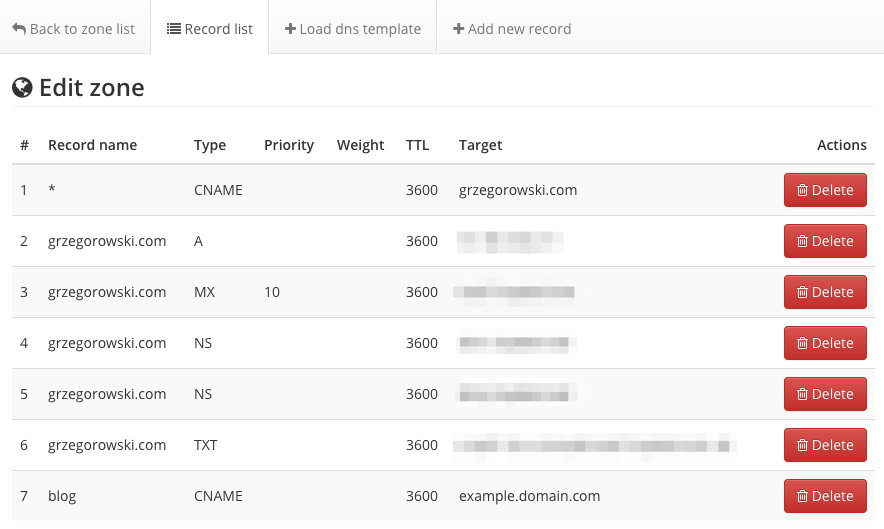

In order to check your current DNS records, you may use this tool https://www.samdns.com/

It allows you to specify DNS server, so you don't need to wait for the DNS propagation or clearing any cache.

It is especially useful if you are unsure how does your provider DNS panel work and to check if all the records you have edited/added are correct.

If you don't know your provider DNS server IP address use a command line utility like `ping` or just paste DNS domain name inside "DNS Lookup" Domain field. In this example I'm looking for the IP of the `dns1.mydevil.net` DNS server.

Then click "Go". As a result you will find A record for your DNS domain name which is an IP address you are looking for.

### An example check for CNAME record.

Enter the DNS record you are looking for, select its type and fill the DNS IP address (your provider DNS).

Here is how results may look like. In case of the CNAME record in the **Answer** column you will see the domain which is pointed by your source domain.

### CNAME configuration example
Adding a subdomain CNAME record to the DNS is just adding a record to your main domain DNS records list. For example, if you want to add a CNAME record which will point `blog.grzegorowski.com` to some other domain (let say `example.domain.com`) you would probably add the following line to the main domain records list:

All your domain DNS records may look as follows:

This example is from my current hosting provider (Mydevil.net), but depending on the provider configuration you may need to end **Target** domain with a dot e.g. `example.domain.com.`.
