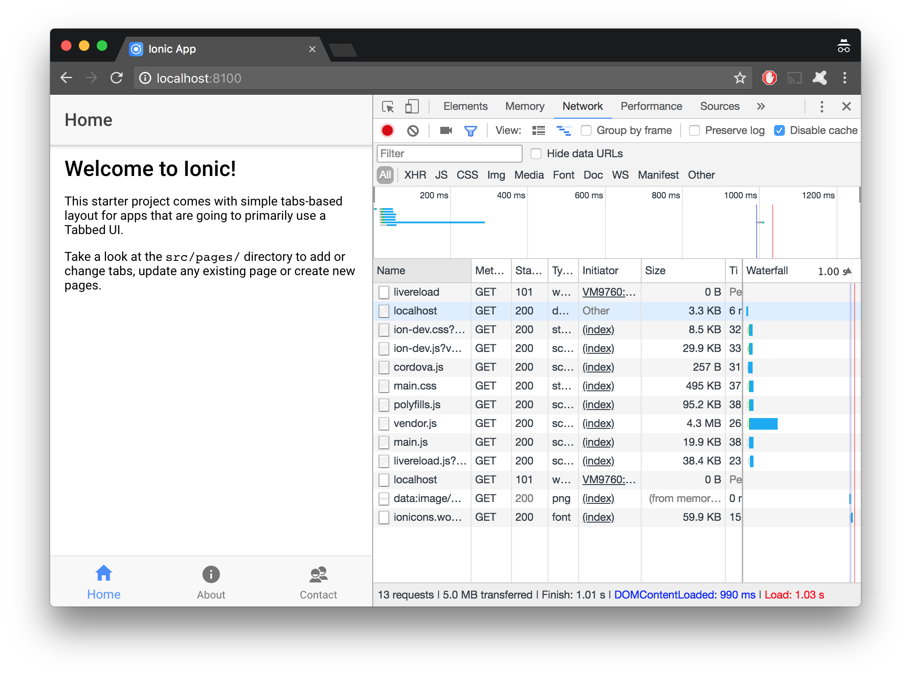
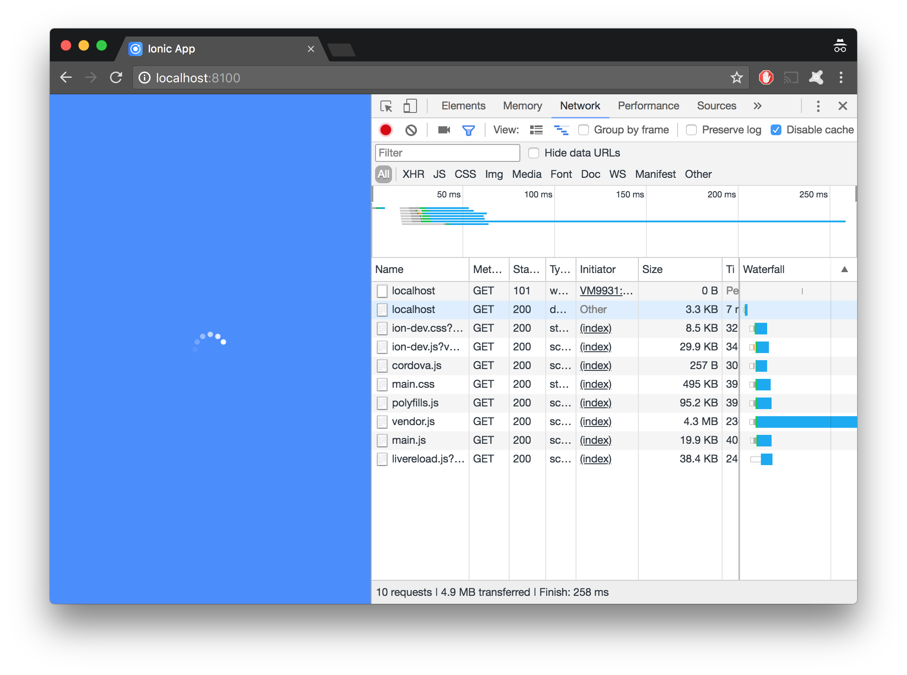
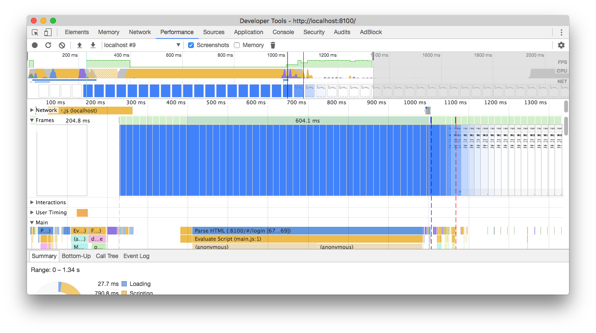

The Splash Screen component is available for a long time but only as [Ionic Native component](https://ionicframework.com/docs/native/splash-screen/), so we can't use it inside browser. I will describe here my approach to create a browser compilant splash screen implementation for Ionic 3 based applications.

## Github
The complete code with all modifications may be reviewed on the Github repository [ionic-splash-screen-pwa](https://github.com/jmarceli/ionic-splash-screen-pwa).
Demo is available on https://jmarceli.github.io/ionic-splash-screen-pwa/ (you won't see much unless you simulate not-so fast "Fast 3G" connection in Google Dev Tools)

## Step 1 - Initialization
Let's start by creating sample project according to the official [docs](https://ionicframework.com/getting-started).
```bash
ionic start splash-screen-ionic tabs
```
After answering a few simple questions (with "n" - for no) you should see the sample app.

**At this point please make sure that you've checked "Disable cache" in Chrome Dev Tools. It is required to view the results easily.**
Now refresh browser tab with your App. You should see a "flash" of white screen before viewing actual App content.

## Step 2 - Preloader
The splash screen should be simple and shouldn't require any images in order to load as fast as possible.

As an example let's use the Ionic theme primary color. In order to do so append this code to the **src/app/app.scss** file:
```scss
body {
  background: color($colors, primary);
}
```
Now after refreshing the App you will see no white screen at all (it will be blue screen instead).
But wait it is just a background color change not a "real" splash screen!

Time to mess with some HTML. Nice HTML/CSS based "preloaders" may be found on the [SpinKit](http://tobiasahlin.com/spinkit/) project pages. I will use the **fading-circle** animation but feel free to select your own (you may, of course, change it later).
Open **src/index.html** and after `<ion-app></ion-app>` add following lines (please note that top `<div>` has an ID, it will be important):
```html
<!-- custom splash screen (non-angular component) -->
<div id="splash-screen" class="splash">
  <div class="sk-fading-circle">
    <div class="sk-circle1 sk-circle"></div>
    <div class="sk-circle2 sk-circle"></div>
    <div class="sk-circle3 sk-circle"></div>
    <div class="sk-circle4 sk-circle"></div>
    <div class="sk-circle5 sk-circle"></div>
    <div class="sk-circle6 sk-circle"></div>
    <div class="sk-circle7 sk-circle"></div>
    <div class="sk-circle8 sk-circle"></div>
    <div class="sk-circle9 sk-circle"></div>
    <div class="sk-circle10 sk-circle"></div>
    <div class="sk-circle11 sk-circle"></div>
    <div class="sk-circle12 sk-circle"></div>
  </div>
</div>
```
Then head to **src/app/app.scss** and append a few more lines:
```scss
.sk-fading-circle {
  margin: 100px auto;
  width: 40px;
  height: 40px;
  position: relative;
}
.sk-fading-circle .sk-circle {
  width: 100%;
  height: 100%;
  position: absolute;
  left: 0;
  top: 0;
}
.sk-fading-circle .sk-circle:before {
  content: '';
  display: block;
  margin: 0 auto;
  width: 15%;
  height: 15%;
  background-color: #333;
  border-radius: 100%;
  animation: sk-circleFadeDelay 1.2s infinite ease-in-out both;
}
.sk-fading-circle .sk-circle2 {
  transform: rotate(30deg);
}
.sk-fading-circle .sk-circle3 {
  transform: rotate(60deg);
}
.sk-fading-circle .sk-circle4 {
  transform: rotate(90deg);
}
.sk-fading-circle .sk-circle5 {
  transform: rotate(120deg);
}
.sk-fading-circle .sk-circle6 {
  transform: rotate(150deg);
}
.sk-fading-circle .sk-circle7 {
  transform: rotate(180deg);
}
.sk-fading-circle .sk-circle8 {
  transform: rotate(210deg);
}
.sk-fading-circle .sk-circle9 {
  transform: rotate(240deg);
}
.sk-fading-circle .sk-circle10 {
  transform: rotate(270deg);
}
.sk-fading-circle .sk-circle11 {
  transform: rotate(300deg);
}
.sk-fading-circle .sk-circle12 {
  transform: rotate(330deg);
}
.sk-fading-circle .sk-circle2:before {
  animation-delay: -1.1s;
}
.sk-fading-circle .sk-circle3:before {
  animation-delay: -1s;
}
.sk-fading-circle .sk-circle4:before {
  animation-delay: -0.9s;
}
.sk-fading-circle .sk-circle5:before {
  animation-delay: -0.8s;
}
.sk-fading-circle .sk-circle6:before {
  animation-delay: -0.7s;
}
.sk-fading-circle .sk-circle7:before {
  animation-delay: -0.6s;
}
.sk-fading-circle .sk-circle8:before {
  animation-delay: -0.5s;
}
.sk-fading-circle .sk-circle9:before {
  animation-delay: -0.4s;
}
.sk-fading-circle .sk-circle10:before {
  animation-delay: -0.3s;
}
.sk-fading-circle .sk-circle11:before {
  animation-delay: -0.2s;
}
.sk-fading-circle .sk-circle12:before {
  animation-delay: -0.1s;
}
@keyframes sk-circleFadeDelay {
  0%, 39%, 100% { opacity: 0; }
  40% { opacity: 1; }
}
```
Browser prefixes were omitted for brevity but you should copy entire code from mentioned SpinKit project page. It is available after clicking on "Source" link (on the top of the page).
Finally add some custom CSS to **src/app/app.scss** which will position the animation:
```scss
#splash-screen {
  opacity: 1;
  transition: opacity 0.2s;
  position: absolute;
  width: 100%;
  height: 100%;
  z-index: 999;
  display: flex;
  align-items: center;
  justify-content: center;
  background: color($colors, primary);
}
```

Now our splash screen/preloader looks much nicer.

Still there is a room for improvement as it is not hiding even after the App is fully loaded...

## Step 3 - Fading out
It's time to add some JS to our **src/app/app.component.ts** which will handle splash screen hiding when App is ready. Open mentioned file and replace its content with:
```js
import { Component } from '@angular/core';
import { Platform } from 'ionic-angular';

import { TabsPage } from '../pages/tabs/tabs';

@Component({
  templateUrl: 'app.html'
})
export class MyApp {
  rootPage:any = TabsPage;

  constructor(public platform: Platform) {
    this.handleSplashScreen()
  }

  // hide #splash-screen when app is ready
  async handleSplashScreen(): Promise<void> {
    try {
      // wait for App to finish loading
      await this.platform.ready()
    } catch (error) {
      console.error('Platform initialization bug')
    }

    // Any operation that shoud be performed BEFORE showing user UI,
    // in a real App that may be cookie based authentication check e.g.
    // await this.authProvider.authenticate(...)

    // fade out and remove the #splash-screen
    const splash = document.getElementById('splash-screen')
    splash.style.opacity = '0'
    setTimeout(() => { splash.remove() }, 300)
  }
}
```
Save it. Your App is ready!

Here is a description of **src/app/app.component.ts** modifications

### imports
First of all `@ionic-native` **StatusBar** and **SplashScreen** were removed because we are dealing with browser only app. This is also the reason why we can simplify MyApp `constructor()` method.

### constructor()
As mentioned above, no need for native components.

### handleSpashScreen()
This method will take advantage of `async/await` construction supported by the Ionic 3 Framework. Reading method code line by line:
1. We are waiting for App to be ready with `await`
2. Then we may execute some initialization related custom code
3. Finally **#splash-screen** should fade out and then it should be removed, timeout of **300 ms** is not a general solution but in this case **200 ms** animation is hardcoded into CSS, so it should be a reasonable value

The result (from Chrome Performance tab):


## Evaluation
Is it any better than it was before **#splash-screen** modification?

**Before** adding the splash screen inside Chrome Performance tab we can see this:

So the App shows blank page for first **1100ms** while splash screen "solution" should make an impression that something is going on just after **~300ms**. For larger applications with much more JS (or slow GSM connections) this difference should be even larger.

## Disclaimer
All tests were performed using local build and integrated webpack web server. So the results for [Demo page](https://jmarceli.github.io/ionic-splash-screen-pwa/) accessed through the Internet should/may be different.

## Sources
These are pages I was looking at while creating my solution:
https://ionicframework.com/docs/native/splash-screen/
https://angularfirebase.com/lessons/generate-a-custom-spash-screen-and-icons-in-ionic/
http://tobiasahlin.com/spinkit/
https://stackoverflow.com/questions/29017379/how-to-make-fadeout-effect-with-pure-javascript#answer-29017677
