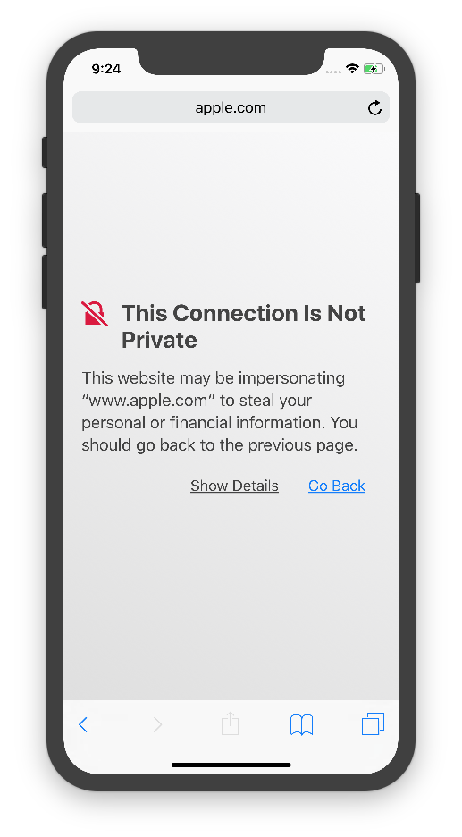
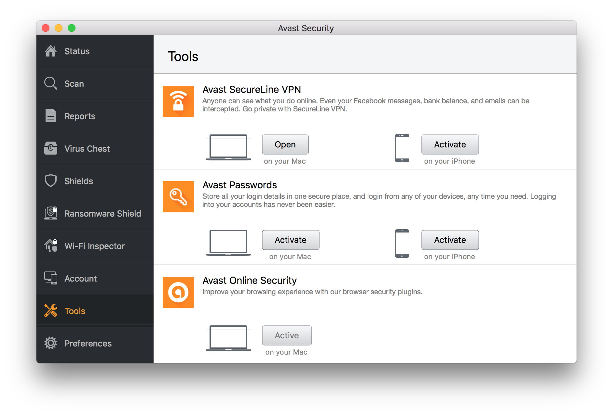
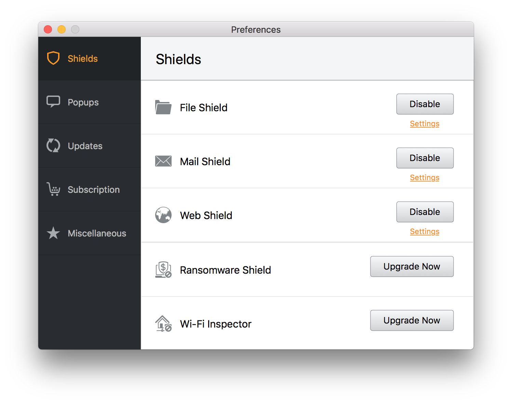
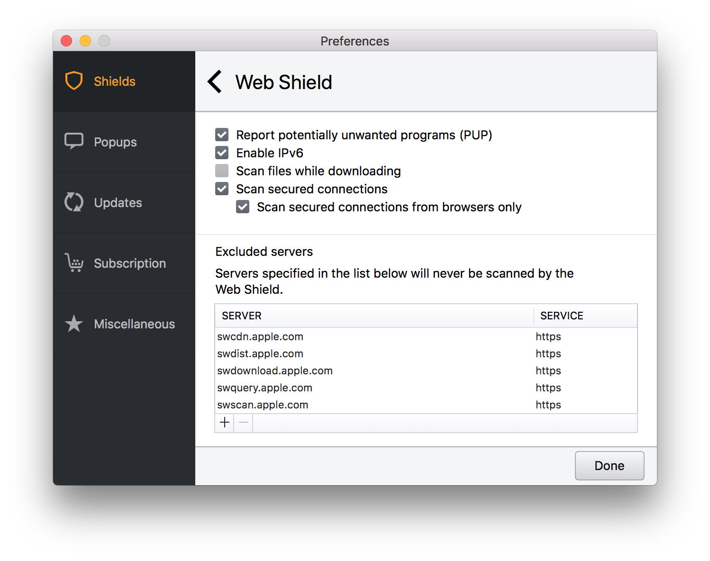
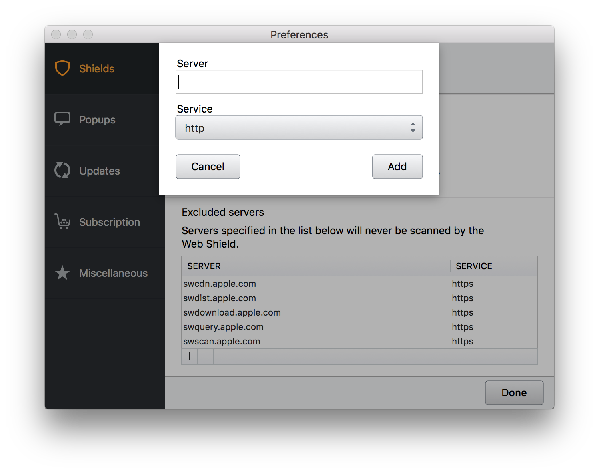

iOS simulator is a handy tool available for every OS X user but you may encounter **This Connection Is Not Private** or other strange bugs when using it along some antivirus software.

## Problem

If you have a problem with running your iOS App/WebApp inside simulator please check if you can establish **any** SSL connection. In my case it wasn't possible to connect to even https://apple.com.

After scratching my head a couple of times I finally found a solution which was changing Avast Security settings. Let's start from the beginning.

## Solution

Open your Avast antivirus program and you should see something like this.

Under **Tools** tab you will find this popup.

Then you may try to click on **Disable** button next to **Web Shield** option and check if this resolves the issue.
If so reenable the **Web Shield** and proceed to the less **radical** solution :)

Click on the **Settings** link under the **Disable** button and you should see the following configuration.

The preffered solution would be adding **Excluded servers** with plus sign on the bottom of the excluded servers list. In the popup type in desired server address e.g. **apple.com** and select **https** in **Service** selection.

If you don't know the address or need more universal solution you may uncheck **Scan secured connections** checkbox but I think that this is less desirable solution.

This solution probably may be applied to other antiviruses which are scanning your SSL secured connections. Fell free to comment if you come across similar problem.

## Sources

Official Apple forum - https://forums.developer.apple.com/thread/90510

