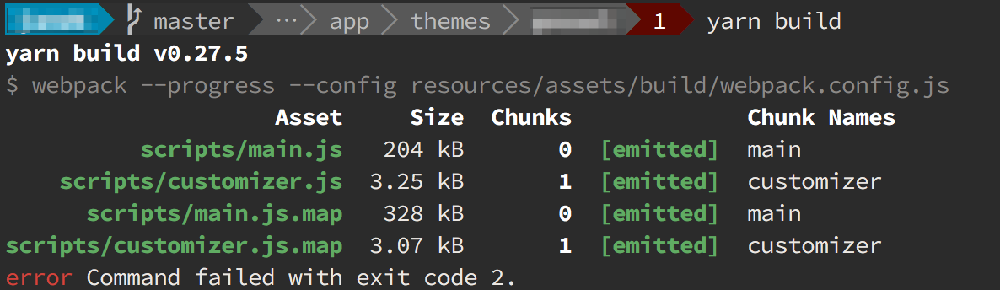
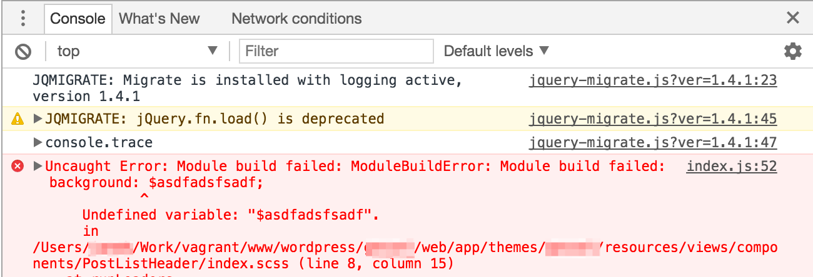
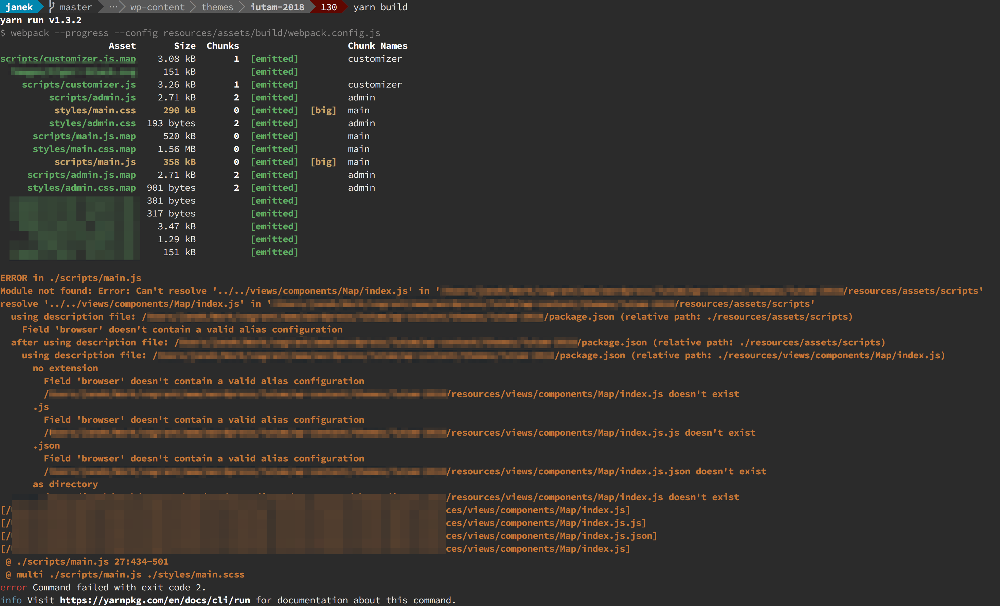

During assets compilation with `yarn start`, `yarn build` or `npm run build` you may run into this error:

> error Command failed with exit code 2



## Workaround

In order to fix it try to open the website and check browser console. There should be some JS/CSS error listed (marked with red color).
The message should be descriptive enough to give you an idea about possible solutions.



Unfortunately, such errors may also occur during the `yarn start` or `npm start` command execution and you will not get **any message**. So if your theme doesn't work after `yarn start` you should execute `yarn build` in order to look for (building) errors.

It is also a good idea to run `yarn lint` sometimes in order to avoid linting error messages during assets building.

Above instructions are valid for **Sage 9.0.0-beta.4**, but other 9.x versions would probably behave in a similar way.

## Fix

In order to get error reporting back to the console edit **resources/assets/build/webpack.config.js** file and change (the ellipsis **...** stands for code which shouldn't be modified):

```js
let webpackConfig = {
  ...
  stats: {
    ...
    errors: false,
    errorDetails: false,
...
```
to
```js
let webpackConfig = {
  ...
  stats: {
    ...
    errors: true,
    errorDetails: true,
...
```
As a result you will get a full error message similar to this:



### Hint

In my case, this error was caused by something which is stored inside **.cache-loader** directory which is placed directly inside your Sage theme directory. The solution was easy, just delete the **.cache-loader** dir.

### Sources

https://discourse.roots.io/t/yarn-build-error-exit-code-2/10225/3
https://discourse.roots.io/t/command-line-lint-errors-gone-in-beta-4/10227?u=40q
