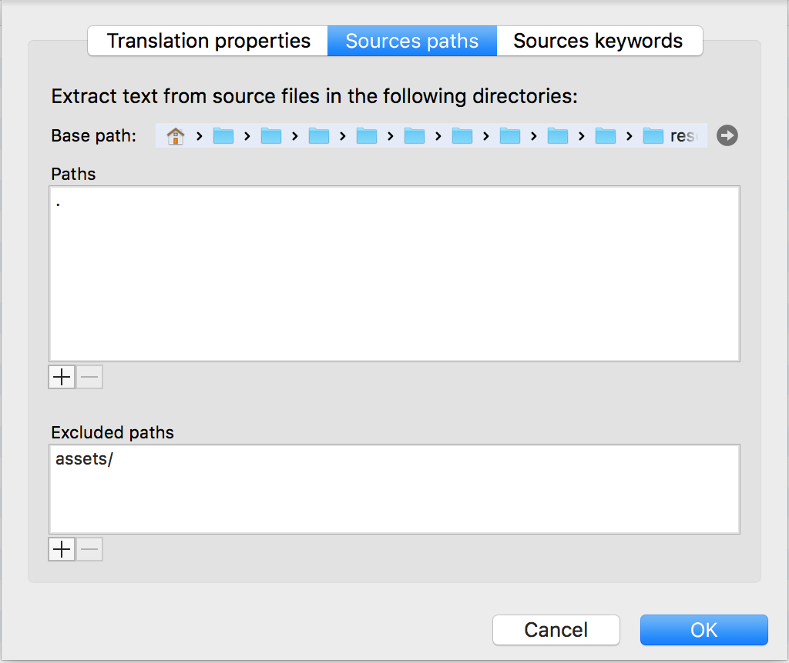
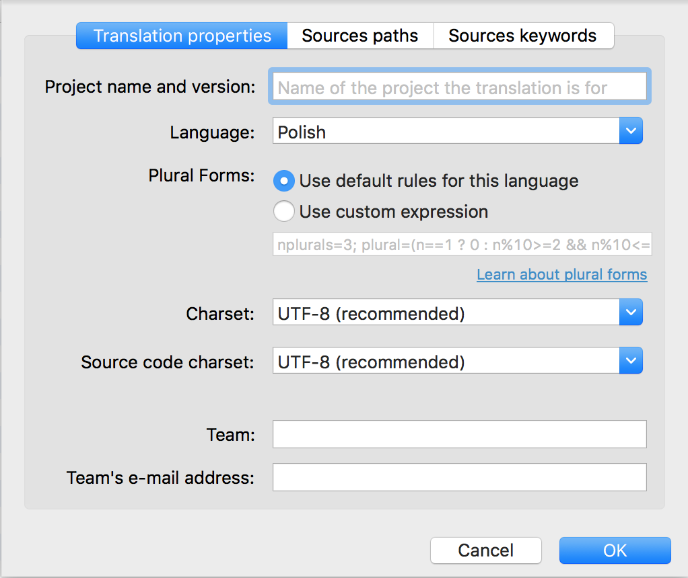
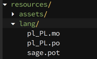

Adding translations to the current Roots Sage version (which is 9.0.0-beta.4) is not as easy and standard as it was in previous versions.

First of all, you have to configure your Poedit editor in order to support Blade templates. Described configuration is taken from [the official forum](https://discourse.roots.io/t/localization-of-blade-templates/9331/6#post_6):

1. Open **Poedit**
2. Go to **Preferences -> Extractors**
3. Add a new Extractor with following settings:
Language: **Blade**
Extension: ***.scout.php, *.blade.php**
Parser command: **xgettext --language=Python --add-comments=TRANSLATORS --force-po -o %o %C %K %F**
An item in keyword list: **-k%k**
An item in input files list: **%f**
Source code charset: **--from-code=%c**
4. Click Ok

Now when your Poedit is ready to handle Blade template files go to the **Sources paths** setup (it's in **Catalogue -> Properties** menu).

It's important to set theme **resources/** subdirectory as a root and then exclude **assets/** subdirectory.



In order to avoid **non ASCII** error message please setup **Source code charset** as **UTF-8** (it's inside **Translation properties** tab).



And last but not least. Your **lang/** subdirectory where all translation files lives should also be placed inside **resources/** directory. Here is how your folder structure may look like:



One more thing is placing the following code inside **functions.php** file:

```php
add_action('after_setup_theme', function () {
    // Community translations can be found at https://github.com/roots/sage-translations
    load_theme_textdomain('sage', get_template_directory() . '/lang');
});
```

This code will tell the Wordpress where it should look for the translations files.

That's it. If you place your Poedit generated translations inside **resources/langs** folder it should work as usual.
